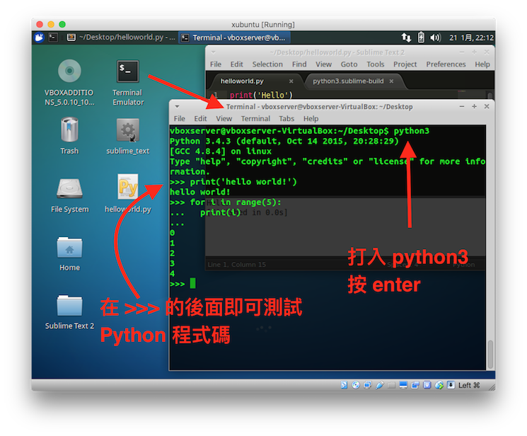
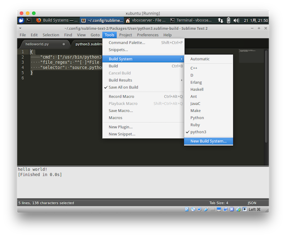
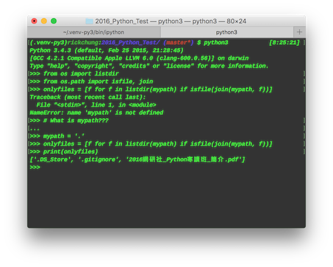

# Moduel 1 - Python Basic
---

## 1. 學這堂課要幹麻

>才上班沒兩個禮拜的你是一家公司的系統助理，有一天老闆叫你進入辦公室，告訴你公司在上一次的系統更新後文件系統出了差錯，所有的文件都亂了序，檔名也發生了一些錯亂，那些原本應該是 「地區_使用者_2016-01-16.txt」 的檔案全部都被改了檔名，日期向前移了 4 年又 2 天，原有的地區以及擁有者名稱也變成了數字，例如「1_2_2012-01-14.txt」，這些混亂的檔案高達數百個。老闆相信你這個剛從資管系畢業的高材生，應該能很容易的就把這個問題處理好，因此命令你在今天之內把所有的檔名都變回去原本的樣子，並按照每個號碼對應的檔案所有者以及地區名稱將其分入「北區」、「中區」、「南區」以及「其他地區」的資料夾中，他希望在明天上班時能看到我們的文件系統一如過往。

>你該怎麼辦？

### 在這堂課中你將學會

- 如何在電腦上運行 Python 程式
- Python 的語言基礎概念
- Python 語法、基礎 I/O、流程控制
- Function 的概念
- 在遇到問題時知道去哪裡尋求解答
- 使用 Python 進行簡單的系統檔案管理
- 幫老闆一次把所有的檔案都改名，解決你的工作危機

## 2. 課程大綱

- 前言 - 程式是一個怎麼樣的東西？我怎麼樣去體會他？
- Python 簡介
- Python 安裝
- Python 的互動式界面
- 如何撰寫一個 Python script
- 如何運行一個 Python 程式
- 印不出中文的問題
- Python 的註解
- 基本輸出
- 變數概念
- 基本運算
- Python 可以讓我存什麼？基本資料型態與常用的資料容器
- 資料型態的轉換
- 如何接收輸入？
- 同一段程式要跑很多次？流程控制與迴圈 
- 重用你的程式碼：函數（function）的概念
- Python 還有很多很多的函數跟細節
- Error !? 遇到問題該怎麼辦？
- A. 額外閱讀資料

## 3. 有問題嗎？尋求幫助

## 4. 本課程的開發環境

在此課程中將採用 **Python 3.4**，但其實只要是 Python3 就可以了，我們課程的主要目標是帶大家快速的了解 Python 的使用方式，並不會探究不同語言版本之間的差異。

為什麼不用 Python2？很多 Python2 的支持者認為 Python2 最大的優勢在於有很多的 Python 函式庫只有 Py2 的版本，但 Python3 有一些改進的特色我認為是比較適合第一次接觸 Python 的人。其實你如果掌握了 Python 3 的概念以及語法，需要用到 Python 2 時也不會有太大的問題。我自己也是常常換來換去用的。

另外對於大多數的使用者而言，Py3、Py2 的最大差異僅僅體現在某些語法上的表達以及函數使用的細節而已，這個部分等我們碰到問題的時候再來解決吧（你如果很急切地想知道的話，可以[點這裡](http://lmgtfy.com/?q=python3+python2+key+differences)）。

然而在後面的課程中所使用到的函式庫不一定會有 Python 3 的版本，到時候會再解釋差異的部分。


---

## 前言 - 程式是一個怎麼樣的東西？我怎麼樣去體會他？

程式就是為了讓機器完成我們想要他做的事情，而必須對機器下達的指令。

**那到底應該怎麼樣讓機器完成我們想要他做的事情？**

我想對於初學程式的人，或者是剛學程式不久的人來說，程式就是打一些無聊的指令，然後按下 run 以後在一個黑白螢幕上顯示出 Fibonacci sequence 或是九九乘法表嗎？這樣到子我到底要怎麼樣讓程式達成我想要做的事情？

我想對於許多人來說這是一個共通的疑問，會造成這些疑問的原因我想是來自於許多的程式課程教學上都是採用 bottom-up 的模式，也就是「先告訴你很多很多的原理，像堆金字塔的方式慢慢向上堆積」，這樣的模式有它的好處，扎實的基礎對於學習任何東西來說都有非常大的幫助。然而，這種學習模式最大的問題就是，你很難明白自己到底在學什麼，甚至是忘記自己到底在學什麼，也因此許多的學生經常會碰到的問題就是「上這東西有什麼用處？」

現在想像一個情境，你想要自己做蛋糕來吃，因此你開始學習做蛋糕，教學課程告訴你，你得從雞蛋要幾度才會熟、麵粉是什麼組成的、糖跟鹽巴差異在哪裡等等問題開始研究，了解每一個器具背後的意涵以及他們是怎麼製造的過後，你才能開始做蛋糕開始混料。

你有聽說過這樣子學習製作蛋糕的嗎？我只是想吃個蛋糕啊！

在過去許多的程式課程都有一貫的架構：語法、基本輸入輸出、變數、資料型、流程控制、函式庫，想想看在過去你所修習的程式課程，是不是都長這個樣子？等到你上完流程控制以後，學期也結束了。放個假以後，變數的範圍從多少到多少你大概也忘了幾個零。

在這堂課裡面我們不這樣做，我們不會花很多時間告訴你變數的範圍是多少到多少、一個浮點數佔用多少記憶體，也不會要你花時間去記億背誦那些數字或者 print 應該要放什麼參數，我們將從應用出發，採用 top-down 的學習模式，先告訴你到底能夠做什麼，你有興趣才去深究其原理。在每一個課程中你都能夠得到一個現實之中的情境，是能夠透過電腦程式來解決的問題，而不只是印印乘法表就下課。我們將從情境開始，一步一步帶你瞭解這個情境之中你應該怎麼樣運用程式去解決問題，另外在每一次的課程中都會有一個練習題，這個部分是讓你熟悉跟磨練在課程中所學習到的東西，若你希望所學的程式技能更上一層，希望你能夠花一些時間去思考那些問題。

在第一堂課中，我們還是得來學習一下 Python 裡最最最基礎的一些東西，top-down 指的不是我們直接開始下載套件包然後安裝寫應用（你不能連程式都不知道如何執行就開始寫 Blog 吧？），而是我們要時時記得「我們現在學這個是要幹麻？」。因為課程時間短暫，在學習基礎的過程中，我們無法將所有的細節都涵蓋，因此當你遇到問題時，你可以先嘗試「我這樣寫可不可以？」，再查查資料，若還是無法理解時，歡迎隨時向講師發問。


---

## Python 簡介

這邊就直接引用 Wiki 吧...

>Python（英國發音：/ˈpaɪθən/ 美國發音：/ˈpaɪθɑːn/），是一種物件導向、直譯式的電腦程式語言，具有近二十年的發展歷史。它包含了一組功能完備的標準庫，能夠輕鬆完成很多常見的任務。它的語法簡單，與其它大多數程式設計語言使用大括弧不一樣，它使用縮進來定義語句塊。[Wiki](https://zh.wikipedia.org/wiki/Python)

另外你可以在 Python 中下 `import this` 來看到 Python 的設計理念與哲學。


```python
import this
```

    The Zen of Python, by Tim Peters
    
    Beautiful is better than ugly.
    Explicit is better than implicit.
    Simple is better than complex.
    Complex is better than complicated.
    Flat is better than nested.
    Sparse is better than dense.
    Readability counts.
    Special cases aren't special enough to break the rules.
    Although practicality beats purity.
    Errors should never pass silently.
    Unless explicitly silenced.
    In the face of ambiguity, refuse the temptation to guess.
    There should be one-- and preferably only one --obvious way to do it.
    Although that way may not be obvious at first unless you're Dutch.
    Now is better than never.
    Although never is often better than *right* now.
    If the implementation is hard to explain, it's a bad idea.
    If the implementation is easy to explain, it may be a good idea.
    Namespaces are one honking great idea -- let's do more of those!


## Python 安裝

你有兩種方式來學習這個課程的內容，一種是將自己的電腦裝上 Python，另一種則是使用我們提供的 VM 虛擬機。

### 1. 使用 VirtualBox 

為了讓我們的成員擁有一個統一的作業環境，也為了減少不同作業系統之間的差異，我們所有的 code 都在我們的虛擬機上執行並測試。若你不想要花時間在安裝 Python 或設定環境，可以到下載網址下載 VirtualBox 的映像檔。虛擬機所採用的作業系統為 Xubuntu 14.04。

- 帳號：vboxserver
- 密碼：vboxserverfortest

如果你想把這個虛擬機拿來用在重要的目的上，務必自行修改帳號密碼。

### 2. 自行安裝

#### Windows 

到下載網址中下載對應的安裝檔，然後開啟安裝，記下安裝路徑，接著一直按下一步就好了。（不要載到 Python 2 了）

下載網址：https://www.python.org/downloads/windows/


#### OSX

OSX 自帶有 Python，不用裝。
如果沒有 Python3 的話麻煩跟講師說一聲，或者你自己 Google 怎麼裝 XD。

#### Linux

大多數的 Linux 發行版都自帶有 Python，不用裝。
如果沒有 Python3 的話麻煩跟講師說一聲，或者你自己 Google 怎麼裝 XD。


## Python 的互動式界面

Python 是一套直譯式的語言，白話來說就是，讀到那一行才進行編譯並執行，基於這樣的特性，Python 提供了一個非常方便的互動式介面，使用者直接在介面中輸入 Python 的指令，便可以立即得出結果。這項功能非常適合開發人員進行測試以及學習。

### OSX and Linux 使用者

想要開啟 Python 的互動式介面，可以直接在 terminal 裡打 python3（打 python 可能會呼叫出 Py2 的直譯器）



### Windows 使用者

對於使用 Windows 的小夥伴，也可以直接在 cmd 裡面打 python 呼叫出 Python 直譯器，或者使用 Python 自帶的 GUI 直譯器介面（通常會在 Python 的安裝路徑底下）。

如果遇到路徑問題，請參考這裡：http://stackoverflow.com/questions/3701646/how-to-add-to-the-pythonpath-in-windows-7


## 如何撰寫一個 Python script

撰寫 Python script 只需要一個你喜歡的編輯器即可，在我們提供的虛擬機中，已經包含了 Sublime Text 2，這是一個功能強大的代碼編輯器，並且自帶有方便的 build system，只要一個指令就可以直接執行你的 Python script。


```python
print('Hello World!') # 只有一行的 Python 程式
```

    Hello World!


## 如何運行一個 Python 程式

### VirtualBox 裡面的 Sublime Text 2

確定 Tools > Build System 內選擇的是 Python3，接著按下 Ctrl+B （或 Tools > Build） 即可運行，並在下方看到運行結果。


### 你自己的 Sublime Text 2 

操作方式與上面一個相同，但你可能沒有 Python3 的 Build System，要自己新增。

點選 Tools > Build System > New Build System ，接著複製貼上以下內容

```json
{
    "cmd": ["python", "-u", "$file"],
    "file_regex": "^[ ]*File \"(...*?)\", line ([0-9]*)",
    "selector": "source.python",
    "env": {"PYTHONIOENCODING": "utf-8"},
    "encoding": "utf-8"
}
```

其中 cmd 內的 "python" 的要改為你的 Python 3 執行檔的路徑，在 Linux/OSX 裡通常會是 /usr/bin/python3，若是 Windows 則預設是 ...

完成後存檔並取名為 python3.sublime-build，你就可以在 Build System 中看到 python3 的選項。




### command line （你可能要稍微熟悉一下 command line）

這是最直接的方式，透過呼叫 Python 直譯器程式來運行 Python script

```bash
$ python3 my_python.py
```


## 如果你在 Terminal/cmd 中印不出中文的話

建議使用 Sublime Text 並使用上面的方法新增 Build System。

## 如果你想在檔案裡用中文註解或是中文字串（不建議）

請在你的 script 最前面加上 `# -*- coding: utf-8 -*-` 指定 Python 在解讀這個文件時會用的文件編碼。

## Python 的註解

在 Python 裡單行註解使用 # 開頭


```python
# 單行註解
```

## 基本輸出

在 Python 中，我們不用像 C 語言那樣 include 很多很多東西才能做到基本的輸出，我們只需要直接打入 `print()` 就可以將資料輸出。


```python
# 把東西輸出到螢幕上
print(1)
print(2)

# 不放東西的話可以當成單純換行使用
print()
print('---')
```

    1
    2
    
    ---


在 C 語言中，我們往往為了要輸出不同型態的資料使用不同的輸出方法，但在 Python 中 `print()` 是一個萬能的輸出方法，我們可以輸出任何我們想要輸出的東西，再也不需煩惱格式轉換的問題。


```python
# 輸出整數
print(12321)

# 輸出浮點數
print(3.14159)

# 輸出布林值
print(True)

# 輸出字串
print('用兩個 \' 或是 \" 包起來的就是字串')
print('"地區_使用者_2016-01-16.txt" 變成了 "1_2_2012-01-14.txt"')
print('聽說在 C 語言裡面是這樣子輸出的\nprintf("聽說在 C 語言裡面是這樣子輸出的\\n");')
```

    12321
    3.14159
    True
    用兩個 ' 或是 " 包起來的就是字串
    "地區_使用者_2016-01-16.txt" 變成了 "1_2_2012-01-14.txt"
    聽說在 C 語言裡面是這樣子輸出的
    printf("聽說在 C 語言裡面是這樣子輸出的\n");


在某些時候我們可能會需要輸出一些**特殊字符**，例如換行、tab，這時我們可以用所謂的 '\' 跳脫字符來幫助我們輸出


```python
# 輸出換行符號 \n
print('下面會換兩行，print 自己會換一行 \n')
print('^^^^^ 換了兩行 ^^^^^')
print()

# Tab \t
print('可以用Tab\t這樣')
print('排版這回事\t大概是這樣')
print()
```

    下面會換兩行，print 自己會換一行 
    
    ^^^^^ 換了兩行 ^^^^^
    
    可以用Tab	這樣
    排版這回事	大概是這樣
    


`print()` 也可以讓我們一次輸出很多東西


```python
# 輸出一堆東西（預設用空格隔開）
print('可以一次輸出很多東西：', 1, 2, 3, 'wu', 'wu', 'la', 'la')
```

    可以一次輸出很多東西： 1 2 3 wu wu la la


我們還能夠傳入一些「設定值（參數）」來改變 `print()` 的行為，請習慣這樣子的語法，在 Python 中是非常常見的


```python
# 改變分隔符號
print('可以在最後面加上 sep= 來決定要用什麼隔開', 'WHO', 2016, '01', 16, '.txt', sep='_')
print()

# 改變 print 的結尾
print('在最後加上 end= 來決定輸出完後最後的結尾要是什麼（預設是換行 \\n）', end='(我把換行換掉了)')
print('<--- 沒有換行')
print('這裡換行了')
print('也可以一起用', 'sep跟', 'end', sep='_', end='(結尾')
print('在這裡沒換行')
```

    可以在最後面加上 sep= 來決定要用什麼隔開_WHO_2016_01_16_.txt
    
    在最後加上 end= 來決定輸出完後最後的結尾要是什麼（預設是換行 \n）(我把換行換掉了)<--- 沒有換行
    這裡換行了
    也可以一起用_sep跟_end(結尾在這裡沒換行


還記得 C 語言裡面的 printf？我們可以在 Python 中使用字串格式化的方法達到同樣的效果


```python
# 熟悉的 printf?，可以使用 % 來格式化字串（塞東西進去字串裡面），注意 % 後面的東西是用 () 包起來的
print( 'O14>> 整數 = %d, 字串 = %s' % (11, 'ABCD') )
```

    O14>> 整數 = 11, 字串 = ABCD


## 變數概念

首先大家要接受一個概念，在 Python 中所有的東西都是「物件（object）」，對於沒有物件導向觀念的同學來說可能會覺得困惑，這邊我會用非常簡單的解釋方法。

在過去有學過其他程式語言的同學可能會知道，我們想要跟電腦說「我要存一個東西在這裡」的時候，必須告訴電腦「我想存的是什麼」，例如在 C 語言中我們會有「宣告一個變數」這樣的動作，例如 `int x;`，這是因為在 C 語言中他使用這樣的做法來「辨識」你寫的那一串 `int x;` 是想要在電腦裡面找一塊地方放一個整數。

對於 Python 來說，他不是使用這樣的方式來「看懂」你所寫的指令， Python 有一套自己的辨識方法，這就是「物件」，所有的東西在 Python 裡都被視為「物件」，Python 使用物件之中的某一些「屬性」來知道使用者想要表達的到底是什麼。


簡單來說，物件就是一堆資料的一個大型容器，你的老闆可以是一個物件，他有身高體重等特性資料，一顆籃球也是一個物件，他有長寬高重量大小等性質數據。當你跟 Python 說 `x = 籃球` 時， Python 會透過內部的一些操作，將 x 這個符號跟籃球這個物件用繩子綁在一起，這樣就完成了「我想把籃球存在 x」裡面這個概念，之後我就可以使用 x 去用那顆籃球。


```python
# 宣告一個變數
x = 10
y = 0.5

# 印出變數
print(x, y)

# 可以直接改存其他東西，Python 都幫你做的妥妥的
x = 0.99993
y = 'OMG'
print(x, y)

# 想存什麼就存什麼
my_var2 = 'my_var2'
print(my_var2)
```

    10 0.5
    0.99993 OMG
    my_var2


## 基本運算

Python 當然也支持一些最基本的加減乘除（你能看懂為什麼會輸出成這樣子嗎？）


```python
a = 2016+4 # 加法
b = 2016-4 # 減法
c = 2016*4 # 乘法
d = 2016/5 # 除法
dd = 2016//5 # 只取整數的除法
print('加法 =', a, '減法 =', b, '乘法 =', c, '除法 =', d, '只取整數的除法 =', dd, sep='\nPM: ', end=' print end')
print()

a = 5**2 # 次方運算
b = 5%2  # 取餘數
print('次方運算', a, '取餘數', b)
```

    加法 =
    PM: 2020
    PM: 減法 =
    PM: 2012
    PM: 乘法 =
    PM: 8064
    PM: 除法 =
    PM: 403.2
    PM: 只取整數的除法 =
    PM: 403 print end
    次方運算 25 取餘數 1


## Python 可以讓我存什麼？基本資料型態與常用的資料容器

### 各式數值

整數、浮點數、布林值都是很常見的資料型態


```python
#  整數 int, ex. 1,2,3,4,5
myint = 123
print(myint)
print(123)

# 浮點數 float, ex. 3.14159
myfloat = 3.14159
print(myfloat)
print(3.14159)

# 布林值 bool
print(True, False)

```

    123
    123
    3.14159
    3.14159
    True False


### 字串 String

在 Python 中當然也有「字串」，而這個字串的操作也是非常方便，你記得你以前怎麼在 C 語言把兩個字串接起來嗎？


```python
# 在 Python 裡面， ' 或是 " 都可以拿來建立字串，效果是一樣的
print('string1')
print("string2")

# 把多個字串接起來？
a = '2016'
b = '0116'
print('a'+ ' + ' + 'b' +' = ' + (a+b))

# 格式化字串
c = 'printf("%s_%s_%s.txt\\n");' % ('Ray', 'Tainan', '20160101')
print(c)

# 想要知道字串有多長？
print('length of c is:', len(c))
print('length of "ABC" is:', len("ABC"))

# 想取出字串裡的某一個字或是某一段字嗎？
d = 'AbCdEfG'
print( 'd[0]=%c, d[2]=%c, d[4]=%c' % (d[0], d[2], d[4]) )

# 注意最後一個，可以用這種方式倒轉字串，自己多試幾個看看
print( 'd[0:3]=%s\nd[2:5]=%s\nd[len(d)::-1]=%s' % (d[0:3], d[2:5], d[len(d)::-1]) )
print( 'd[5:3:-1]=%s' % (d[5:3:-1]))
```

    string1
    string2
    a + b = 20160116
    printf("Ray_Tainan_20160101.txt\n");
    length of c is: 36
    length of "ABC" is: 3
    d[0]=A, d[2]=C, d[4]=E
    d[0:3]=AbC
    d[2:5]=CdE
    d[len(d)::-1]=GfEdCbA
    d[5:3:-1]=fE


### 常用的字串操作方法

還記得前面所說的「Python 裡面所有的東西都被視為物件」這件事情嗎？我們也提到物件是一群資料或者功能的集合體，那我們要怎麼去操作這些物件呢？在 Python 裡面我們使用 '物件.操作方法' 來進行物件的操作，接下來要介紹的字串操作方法，便是使用這個操作方式。


Python 的字串還提供了一些非常常用的操作方法，例如字串搜尋、字串取代以及字串切割等等。


```python
# 字串搜尋
mystr = "OOO_Taiwan_2012-01-14"
print("mystr = " + mystr)
print("Index of string 'Taiwan' in mystr is ", mystr.find('Taiwan'))

# 字串切割（會切成像 array 一樣的 List，下面會介紹）
print(mystr.split('_'))

# 字串取代
print(mystr.replace('2012', '2016'))
```

    mystr = OOO_Taiwan_2012-01-14
    Index of string 'Taiwan' in mystr is  4
    ['OOO', 'Taiwan', '2012-01-14']
    OOO_Taiwan_2016-01-14


### List 清單（也有人叫串列）

還記得在 C 語言中看到的「陣列（array）」嗎？在 Python 中也提供了將大量資料集合在一起的方法：List


```python
# Python 中使用 [] 來建立 List
filenames = ['0001.txt', '0002.txt', '0003.txt', '0004.txt']
# 當然，萬能的 print 也能把它印出來
print(filenames)

# 取出某一個元素或某一些元素（記得上面取出某個字串字元的方法嗎？）
print(filenames[1])
print(filenames[1:3])

# List 長度
print('len of filenames is', len(filenames))

# List 什麼都可以放，即使是不同型態的東西（跟 C 很不一樣吧？）
amazingList = ['this is string', 19932100, 25.17285, True, False, ['the list in list!']]
print(amazingList)

# 存取長度範圍外的東西，會發生錯誤！
# print(filenames[1000])
#
#---------------------------------------------------------------------------
#IndexError                                Traceback (most recent call last)
#<ipython-input-16-e1b44d2c538d> in <module>()
#     16 
#     17 # 存取長度範圍外的東西，會發生錯誤！
#---> 18 print(filenames[1000])
#
#IndexError: list index out of range
#
```

    ['0001.txt', '0002.txt', '0003.txt', '0004.txt']
    0002.txt
    ['0002.txt', '0003.txt']
    len of filenames is 4
    ['this is string', 19932100, 25.17285, True, False, ['the list in list!']]


### 常用的 List 操作方法


```python
# 建立一個空 list
mylist = []

# 加入元素
mylist.append(1)
mylist.append(5)
mylist.append(10)
mylist.append('ABCD')
print(mylist)

# 指定元素
mylist[0] = 2
print(mylist)

# 刪除元素
mylist.pop(3)
print(mylist)

# 反轉清單（注意，這個會將 mylist 本身的內容做反轉，不是建立新的反轉後的 list，做完就回不去了）
mylist.reverse()
print(mylist)

# 串接 lists
mylist2 = [2,4,1,343,234]
print('mylist2 =', mylist2)
mylist3 = mylist+mylist2
print('mylist3 =', mylist3)

# 檢查某個東西是不是在清單裡？（String 字串也可以用，你可以試試看）
print( 10 in mylist3 )
print( '10' in mylist3 )

# 字串排序（注意，這是會改變 mylist3 本身的內容，跟上面的 reverse() 相同，.sort() 完就回不去了）
mylist3 = [8,7,2,1,5,6,3,4]
mylist3.sort()
print(mylist3)

# 字串切片（取出某一個區段的數值，不包含結尾 index）
print(mylist3[3:6])

```

    [1, 5, 10, 'ABCD']
    [2, 5, 10, 'ABCD']
    [2, 5, 10]
    [10, 5, 2]
    mylist2 = [2, 4, 1, 343, 234]
    mylist3 = [10, 5, 2, 2, 4, 1, 343, 234]
    True
    False
    [1, 2, 3, 4, 5, 6, 7, 8]
    [4, 5, 6]


除了 List 外，Python 還提供一種非常好用的「字典（dictionary）」，字典能夠讓使用所謂的 key-value 鍵值對應的方法來存資料，一群鍵值放入一個容器之中，例如我可以在籃球這個字典裡面放入「半徑」、「重量」與「顏色」，分別對應到的值可能是 20, 10, red（是不是很像前面所提到的物件？他們是不是一樣的東西呢？）


```python
# 建立字典
basketball = {'weight': 20, 'radius': 30, 'color': 'red'}
print(basketball)

# 取出資料（跟 list 取出很像，但是用字串進行取出）
print(basketball['weight'])

# 放入新資料
basketball['newdata'] = 0.12345
print(basketball)

# 列出 keys 清單
print(basketball.keys())

# 列出 values 清單
print(basketball.values())

# 用 tuple 的方式列出元素（tuple 是一種有序、不可變得資料容器，下面會介紹）
print(basketball.items())

# 檢查某個 key 有沒有在裡面
print('weight' in basketball)
print('weightt' in basketball)

# 如果要檢查值呢？
print(20 in basketball.values())
print(20+3 in basketball.values())
```

    {'weight': 20, 'color': 'red', 'radius': 30}
    20
    {'weight': 20, 'newdata': 0.12345, 'color': 'red', 'radius': 30}
    dict_keys(['weight', 'newdata', 'color', 'radius'])
    dict_values([20, 0.12345, 'red', 30])
    dict_items([('weight', 20), ('newdata', 0.12345), ('color', 'red'), ('radius', 30)])
    True
    False
    True
    False


在 Python 還有一種很常見的資料容器 tuple，是用來放有序、且不會更動的資料，意思是放進去的資料就不能更改了（所以你如果想要放新的東西進去，只能製作一個新的 tuple）


```python
# 建立 tuple
mytuple = (1,2,3)
print(mytuple)

# 取出元素
print(mytuple[2])
print(mytuple[0:2])

# 嘗試更改元素
# mytuple[0] = 10
#
#---------------------------------------------------------------------------
#TypeError                                 Traceback (most recent call last)
#<ipython-input-38-06de34ccd0da> in <module>()
#      8 
#      9 # 嘗試更改元素
#---> 10 mytuple[0] = 10
#
#TypeError: 'tuple' object does not support item assignment
```

    (1, 2, 3)
    3
    (1, 2)


最後是集合（Set），這個集合可以理解為你在學機率統計時的那個「集合」，是一種無序、元素不可重複的容器，跟字典有點像，但沒有字典 key-value 中的那個 value。


```python
# 建立 set
myset = {1,2,3,4,5,4,3,2,1}
print(myset)

# 可以做集合的操作，例如 union, intersection 等
myset2 = {1,3,4}
print(myset2)
print(myset & myset2)
print(myset | myset2)
```

    {1, 2, 3, 4, 5}
    {1, 3, 4}
    {1, 3, 4}
    {1, 2, 3, 4, 5}


## 資料型態的轉換

我應該要怎麼樣才能把我的字串轉換成數字呢？

前面我們提到了，Python 中所有的東西都是物件，如果我們想要在 Python 轉換物件的型態是相當容易的事情，但使用上必須注意到某些型態之間的轉換是不被允許的。


```python
# 字串 轉 數字
print(int("123"))
print(int("123")+1)

# 浮點數轉數字（會捨棄小數的部分）
print(int(123.223))

# 字串不能和數字相加！
# print("123" + 1)
# ---------------------------------------------------------------------------
# TypeError                                 Traceback (most recent call last)
# <ipython-input-59-9efbf0b06aa6> in <module>()
#       7 
#       8 # 字串不能和數字相加！
# ----> 9 print("123" + 1)
# 
# TypeError: Can't convert 'int' object to str implicitly
```

    123
    124
    123


```python
# 數字轉字串呢？
print(str(12345))
print('數字是：' + str(12345))

# 浮點數
print(float('123.45'))
```

    12345
    數字是：12345
    123.45


```python
# 字串與清單
mystr = 'mystring'
print(mystr, list(mystr))

# 清單變字串？
myliststr = str(list(mystr))
print(myliststr)
print('mystr len =', len(mystr))
print('myliststr len =', len(myliststr))

# What is ".join()"? Compare the lenghts above and below
another_liststr  = "_".join(list(mystr))
theother_liststr = "".join(list(mystr))
print('another_liststr  = ' + another_liststr)
print('len(another_liststr) = ' + str(len(another_liststr))) # Why str(len())? 
print('theother_liststr = ' + theother_liststr)
print('len(theother_liststr) = ' + str(len(theother_liststr)))
```

    mystring ['m', 'y', 's', 't', 'r', 'i', 'n', 'g']
    ['m', 'y', 's', 't', 'r', 'i', 'n', 'g']
    mystr len = 8
    myliststr len = 40
    another_liststr  = m_y_s_t_r_i_n_g
    len(another_liststr) = 15
    theother_liststr = mystring
    len(theother_liststr) = 8


```python
# tuple to list
print(list( (1,2) ))
```

    [1, 2]


型態轉換在我們做資料處理的時候可能會經常用到，大家可以自己試試看轉來轉去的效果，但他有很多的細節跟需要注意的地方，在這邊我們不贅述，有興趣的人可以參考延伸資料。

## 如何接收輸入？

在 Python 要接收使用者的輸入非常容易，只要使用 input() 函是即可，需要注意的是 input() 回傳的輸入結果都是「字串」

```python
x = input('Please input your name: ')
print(x)
```

## 同一段程式要跑很多次？流程控制與迴圈

在這個部分我們會第一次遇到「縮進」的問題，就像過去在 C 語言中我們會用 {} 來標示一個程式碼的區塊，在 Python 則是使用「縮進」的方式，這個縮進可以使用 tab 或者是空格，在這邊我建議各位最好使用「空格」。而在空格的數量上則是個人喜好問題，在這邊我會使用四個空格，但其實只要整個 Python script 都使用統一的縮進格式即可。

### 比較運算子快速瀏覽

- 關係運算：<, >, >=, <=, ==, !=
- 邏輯運算：and, or, not


```python
# 關係運算
print ("1 < 2 \t",  1 < 2)
print ("1 > 2 \t",  1 > 2)
print ("2 >= 2 \t", 2 >= 2)
print ("2 <= 2 \t", 2 <= 2)
print ("2 == 2 \t", 2 == 2)
print ("2 != 2 \t", 2 != 2)

# 邏輯運算
print ("True and True\t",   True and True)
print ("True and False\t",  True and False)
print ("False and False\t", False and False)
print ("True or True\t",    True or True)
print ("True or False\t",   True or False)
print ("False or False\t",  False or False)
print ("not True\t", not True)

# 比較方便的寫法
print ("1 < 3 < 5\t", 1<3<5)
print ("1 < 7 < 5\t", 1<7<5)

# 用來檢查元素有沒有在某個容器內
print ('TPE' in ['TPE', 'TCH', 'TNA', 'KAO'])
print ('Taiwan' in ['TPE', 'TCH', 'TNA', 'KAO'])

# in 用在 Dictionary 時，是在找什麼？
print ('TPE' in {'1': 'TPE', '2': 'TCH', '3': 'TNA', '4': 'KAO'})
print ('2' in {'1': 'TPE', '2': 'TCH', '3': 'TNA', '4': 'KAO'})

```

    1 < 2 	 True
    1 > 2 	 False
    2 >= 2 	 True
    2 <= 2 	 True
    2 == 2 	 True
    2 != 2 	 False
    True and True	 True
    True and False	 False
    False and False	 False
    True or True	 True
    True or False	 True
    False or False	 False
    not True	 False
    1 < 3 < 5	 True
    1 < 7 < 5	 False
    True
    False
    False
    True


### If ... else

「在 Python 裡面所有東西都是物件」，對於 if 判斷式來說，物件是空物件（之後會解釋）、數值 0 或 空字串 '' 都是 False


```python
# 最基本的 if else （有沒有 () 都可以，但要注意順序）
if True:
    print("It's True")
    print("second line")
else:
    print("It's False")

if ('TPE' not in ['TPE', 'TAN']):
    print("TPE is not in that list")
else:
    print("TPE is 'not' not in that list!")
    
# 如果放數字呢？
if 10:
    print('if(10) is True')
else:
    print('oh')
    
if 0:
    print('oh')
else:
    print('if(0) is False')

if 'test':
    print('test')
if not '':
    print('not ""')
```

    It's True
    second line
    TPE is 'not' not in that list!
    if(10) is True
    if(0) is False
    test
    not ""


## If ... elif ... else

如果你需要比較很多條件，Python 提供了一種比較方便的寫法，還記得過去在 C 語言的寫法嗎？

```c
if (a > 50) { ... }
else if (a > 30) { ... }
else if (a > 10) { ... }
else { ... }
```


```python
# If ... ellif ... else
a = 10
if (a > 50):
    print("a > 50")
elif (a > 30):
    print("a > 30")
elif (a > 10):
    print("a > 10")
else:
    print("else")
```

    else


### Loop
Python 的 loop 也比 C 語言好寫得多，其實 Python 的 loop 是去 iterate list，請看下方範例。


```python
print("for loop in range(1,5)")
for i in range(1,5):
    print(i)
    
print("for loop in range(5, 1, -1)")
for i in range(5, 1, -1):
    print(i)
    
print("for loop in range(5)")
for i in range(5):
    print(i)

print("while loop")
i = 5
while (i >=0 ):
    print(i)
    i -= 1

print('for in list?')
for i in [0, 1, 2, 3, 4]:
    print(i)
    
for name in ['TPE', 'TAN', 'TCH', 'KAO']:
    print(name)
    
# 試試 print range() 吧
print(range(10), "不是 list 嗎 ???????")
```

    for loop in range(1,5)
    1
    2
    3
    4
    for loop in range(5, 1, -1)
    5
    4
    3
    2
    for loop in range(5)
    0
    1
    2
    3
    4
    while loop
    5
    4
    3
    2
    1
    0
    for in list?
    0
    1
    2
    3
    4
    TPE
    TAN
    TCH
    KAO
    range(0, 10) 不是 list 嗎 ???????


range 在 Python 裡面是一個特殊型態的東西，這邊我們不仔細說明他到底是什麼，有興趣的人可以參考 Python 官方的文件，[點這裡](https://docs.python.org/3.4/library/stdtypes.html?highlight=range#sequence-types-list-tuple-range)


```python
# 要把 range 轉成 list 也是可以的
print(list(range(10)))
```

    [0, 1, 2, 3, 4, 5, 6, 7, 8, 9]


## 重用你的程式碼：函數（function）的概念

如果你不懂程式語言裡面的 function 是指什麼，可以參考 Google，這邊我給一個非常簡單的解釋：一種將程式碼包裝，並可以重複使用的功能。

在 Python 函數使用 `def` 來定義，我們看範例：


```python
def myfunc():
    print("this is myfunc")
    
myfunc() # call function
```

    this is myfunc


在 Python 裡面，參數並沒有型態（所有東西都是物件），因此參數的順序變得非常重要。
另外 Python 還提供了預設參數的功能，當使用者沒有給予該參數值時，會自動補上預設的參數。


```python
# 參數傳遞
def add(a, b):
    print("%d + %d = %d" % (a, b, a+b))
add(10, 5)

# 預設參數（必須在非預設參數的最後面，注意下方參數傳遞的一些方式）
def add1(a, b=5):
    print("%d + %d = %d" % (a, b, a+b))
add1(10)
add1(10, 10)
add1(7, b=8)
add1(a=7, b=8)   # 可以透過參數名稱來指定參數
add1(b=8, a=7)   # 甚至順序都可以反過來
# add1(b=8, 7)   # 但這個是不行的，想想看為什麼？
```

    10 + 5 = 15
    10 + 5 = 15
    10 + 10 = 20
    7 + 8 = 15
    7 + 8 = 15
    7 + 8 = 15


當然也可以有回傳值


```python
def add(a,b):
    return a+b
x = add(10, 5)
print(x)
print(add(7,2))
```

    15
    9


## Python 還有很多很多的函數跟細節

由於課程能夠使用的時間有限，上面的東西也只是 Python 的一小部分，有很多的功能跟細節我們無法在短短的閱讀教材中鉅細彌遺。其實在實務上，我們也不可能記得所有的函數跟所有的做法，不過多虧 Python 算是一個非常成熟的語言，當我們遇到任何問題，或不知道某些事情 Python 做不做得到的時候，請善用 Google 以及 Python Documentation，往往都能找到合適的答案。

那這要怎麼做呢？例如說我今天想要讓 Python 能狗讀取目前資料夾內所有的檔案名稱，我們通常會這樣做


接著你可以在互動介面來試試看這些用法



看起來很簡單對吧？但網路上對於同樣的問題往往有許多的解法，因此如何將別人提供的方法修改成自己可用的方法，需要許多的嘗試。

## Error !? 遇到問題該怎麼辦？

寫程式遇到問題是非常常見的，Python 在運行發生問題時，會將問題用非常易懂的方式告訴使用者，通常要解決問題，就是仔細閱讀 Python 告訴你的訊息。


```python
mylist = [1,2,3,4,5]
# print(mylist[50])
# ---------------------------------------------------------------------------
# IndexError                                Traceback (most recent call last)
# <ipython-input-33-343e3d7023eb> in <module>()
#       1 mylist = [1,2,3,4,5]
# ----> 2 print(mylist[50])
# 
# IndexError: list index out of range
```

但一定會有一些問題是你無法解決的，這時你有三種做法，1. Google, 2. Google, 3. 找你的導師。

如果對於一個問題不知道該怎麼 Google 時，最快的做法就是直接把錯誤訊息複製貼上。

[Live Demo](http://lmgtfy.com/?q=IndexError%3A+list+index+out+of+range)


---

## A. 額外閱讀資料

### a1. Unicode

如果你想用 Python 處理非英數的資料（例如中文）一定會經常遇到 Unicode 解碼問題。

http://www.csie.ntu.edu.tw/~p92005/Joel/Unicode.html

https://www.ptt.cc/bbs/Python/M.1380034106.A.553.html

### a2. List Comprehension

List comprehension 是一種常見的建立 list 的簡便寫法，能夠讓你寫出更簡潔易讀的 Python 程式碼。

http://www.secnetix.de/olli/Python/list_comprehensions.hawk

### a3. Lambda

lambda 在 Python 中可以視為一種簡便的 function，適當的使用可以讓程式碼更易讀，但是也可能造成反效果，使用上需斟酌。

http://openhome.cc/Gossip/Python/LambdaExpression.html
