# Module 3 - Python With Django: MVC and Web Application

>在檔案風波後，二月的某一天，你被老闆叫進辦公室，他覺得每次都要使用公司電腦才能夠看到資料實在是太麻煩了，而且一個一個的文字檔不但難以觀看，也不容易找到想要的東西。
>
>於是他想到了公司裡有個很會寫網頁的資管系同學（你啊），希望你能製作一個能透過網路連結的網路程式，讓他能夠舒服的在家裡的沙發上使用瀏覽器來存取公司的檔案，提供一個漂亮的介面、完善的資料搜尋系統、方便管理的資料庫以及安全的使用者認證，期限是一個禮拜。
>
>你：不好意思老闆，是一個禮拜嗎？
>
>老闆：恩，一個禮拜呦。
> 
> ...... ( ´Д`)y━･~~

## 學這堂課要幹麻

> "django: The web framework for perfectionists with deadlines."
>
> "Django makes it easier to build better Web apps more quickly and with less code."

網路應用程式是一種透過瀏覽器就可以執行的應用程式，對於現在的大學生來說應該完全不陌生，我們經常在使用的電子郵件、網路硬盤、購物網站甚至一些遊戲等都是一種網路應用程式。

如果你已經學過了 HTML、JavaScript、PHP 以及一些資料庫的概念，基本上你已經有能力架構一個網路程式。

但這是非常不足的，只是掌握這些「最基本」的技術，當你要開發一套完整的系統時，你會花非常多的時間「重新發明新的輪子」，從系統的分析設計、不同功能的開發測試到程式的架構與部署，你都得一個一個慢慢寫慢慢改，對於一個每天都很有空的學生來說還好，但對於每天每天都要花錢的企業來說，這並不是一個好的開發方案。

所以我們要「站在巨人的肩膀上」，要學習使用「前人的輪子」來打造我們自己的應用程式，不但能加快我們的開發進度，還能夠避免很多不必要的 dirty hack，這就是 Web framework 的最大用處。

如果你希望未來以網路技術為工作目標的話，能夠學會至少一種網頁應用程式的框架，在找工作是很有利的（最近看到寫 django 的只要大學畢業薪水 4 ~ 8 萬都有）。

這堂課教的不是「基礎的網路技術」，而是以網路技術為基礎，學習一種更有效率的開發方式。

## 學完這堂課你可以...

- 瞭解網路應用程式的概念
- 使用 Django 開發一套功能完整的網路應用程式
- MVC 架構概念
- Django Model
- Django Template language
- Django View
- Django 表單

## 大綱

* [Module 3 - Python With Django: MVC and Web Application](#module-3---python-with-django:-mvc-and-web-application)
  * [學這堂課要幹麻](#學這堂課要幹麻)
  * [學完這堂課你可以...](#學完這堂課你可以...)
  * [大綱](#大綱)
* [A. Overview](#a.-overview)
  * [a1. Web Application](#a1.-web-application)
  * [a2. Web Framework](#a2.-web-framework)
  * [a3. Django 簡介](#a3.-django-簡介)
  * [a4. 釐清 Django, Apache, PHP 和 MySQL 之間的關係](#a4.-釐清-django,-apache,-php-和-mysql-之間的關係)
  * [a5. 參考資料跟內容來源](#a5.-參考資料跟內容來源)
* [B. MVC 設計概念: Model, View and Controller](#b.-mvc-設計概念:-model,-view-and-controller)
  * [b1. Django 中的 MVC: MTV](#b1.-django-中的-mvc:-mtv)
* [C. Django 起手式](#c.-django-起手式)
  * [c1. 安裝 Django](#c1.-安裝-django)
  * [c2. 建立 Project](#c2.-建立-project)
  * [c3. 設定一下時區（非必要）](#c3.-設定一下時區（非必要）)
  * [c4. 開發用測試伺服器](#c4.-開發用測試伺服器)
  * [c5. 建立一個 App](#c5.-建立一個-app)
  * [c6. Hello World!](#c6.-hello-world!)
  * [c7. 圖例：Django 接收 HTTP request 到 response 的處理流程](#c7.-圖例：django-接收-http-request-到-response-的處理流程)
  * [c8. 小結（Time to take a break）](#c8.-小結（time-to-take-a-break）)
* [D. Model 抽象化、物件導向的資料模型](#d.-model-抽象化、物件導向的資料模型)
  * [d1. 為 Django 設定資料庫](#d1.-為-django-設定資料庫)
  * [d2. 為我們的 app 新增 model](#d2.-為我們的-app-新增-model)
  * [d3. 讓 Django 更新資料庫（Migration）](#d3.-讓-django-更新資料庫（migration）)
  * [d4. Django Admin 介面](#d4.-django-admin-介面)
  * [d5. ORM, Querysets and Django Shell](#d5.-orm,-querysets-and-django-shell)
  * [d6. 懷念 SQL 嗎？](#d6.-懷念-sql-嗎？)
  * [d7. Model 小結（Another time to break）](#d7.-model-小結（another-time-to-break）)
* [E. View 動態網頁的基礎](#e.-view-動態網頁的基礎)
  * [e1. URLConf 的 regular expression（補充）](#e1.-urlconf-的-regular-expression（補充）)
  * [e2. 連結資料庫](#e2.-連結資料庫)
  * [e3. Django views 運作流程圖例](#e3.-django-views-運作流程圖例)
  * [e4. View 小結（10 mins break and we'll back）](#e4.-view-小結（10-mins-break-and-we'll-back）)
* [F. Template 網頁的骨架](#f.-template-網頁的骨架)
  * [f1. HTML](#f1.-html)
  * [f2. Django Template Language](#f2.-django-template-language)
  * [f3. Shortcut: render()](#f3.-shortcut:-render())
  * [f4. Removing hardcoded URLs in our templates](#f4.-removing-hardcoded-urls-in-our-templates)
  * [f5. Javascript 要怎麼辦？（補充）](#f5.-javascript-要怎麼辦？（補充）)
  * [f6. Template 小結（Break time!）](#f6.-template-小結（break-time!）)
* [G. 處理 CSS 檔案 (static files)](#g.-處理-css-檔案-(static-files))
  * [g1. 套用 Bootstrap](#g1.-套用-bootstrap)
* [H. Django 提供的其他功能](#h.-django-提供的其他功能)
  * [h1. 處理 POST, GET 資料](#h1.-處理-post,-get-資料)
  * [h2. Django 表單](#h2.-django-表單)
  * [h3. 使用者認證機制](#h3.-使用者認證機制)
* [延伸閱讀](#延伸閱讀)
  * [WSGI](#wsgi)
  * [REST and RESTful](#rest-and-restful)
  * [Automated testing](#automated-testing)
  * [處理 URL 的命名衝突](#處理-url-的命名衝突)
  * [把你的 Django 程式部署到網路上](#把你的-django-程式部署到網路上)

---

<!--==============================
=            Overview            =
===============================-->
# A. Overview

## a1. Web Application

> "In computing, a web application or web app is a client-server software application in which the client (or user interface) runs in a web browser" --  
[Wikipedia - Web application](https://en.wikipedia.org/wiki/Web_application)

對於生在現代的同學來說，應該對於網頁應用程式完全不陌生，因為我們經常在使用的 Gmail、Dropbox 或是我們課程中的 Trello 
和 hackpad，都是網頁應用程式的一種呈現。但就像很多我們覺得理所當然的技術一樣，如果我們從歷史的角度來看這樣東西就會覺得
非常不可思議。

間單來說，網頁應用程式就是一種能夠「透過瀏覽器的介面」進行操作的應用程式。相較於過去的應用程式得透過特定平台的 GUI 介面、文字介面來運行，網頁應用程式讓我們能夠專注在程式的邏輯本身，而介面的部分就交由網頁技術如 HTML 等，不再需要處理不同平台的介面問題。

只要透過網路就能夠將我們開發的應用程式部署到任何地方，大大的節省了過去需要為不同平台開發不同程式的成本，因此網頁應用程式
也越來越受到企業的重視。

## a2. Web Framework

所謂的 framework 通常中文譯為「框架」，意指一種「預先定義好的程式架構」，在使用框架開發程式時，我們只需要把功能填入框
架之中，框架就能夠依照預先定義的流程運作。

在過去我們想要開發一套基於網頁的應用程式，我們可能需要從分析設計開始定義整個系統的架構，接著針對系統中不同的功能進行開
發、測試，最後將功能與系統架構整合，這樣的開發過程非常的耗費人力物力，尤其在一家企業沒有過去的程式基礎時，要投入如此龐大
的資源來開發一套自己的網路應用程式是非常困難的。

如果你曾經自己用 HTML、PHP 之類的開發過一個網站，包含一些登入登出、表單、檔案上傳、後台等等功能，你大概就能體會自己造輪子是一件多累人的事情。

Web framework 就是一種幫助你開發 Web 程式的 framework，透過該 framework 預先定義好的程式架構以及常用的功能，我們只需要專注在自己產品的開發，其他攸關程式架構、流程以及部署等等的問題都交由 Web framework 解決，大大的減少了開發一套 Web application 所需要的成本。

網頁框架有很多類型，這邊我們要介紹的是比較多用途的 Django，還有另外一個很紅也跟他很像的是 Ruby on Rails（RoR）。


## a3. Django 簡介

Django 就是一個利用 Python 撰寫的 Web application framework。

我覺得用 Django 最大的好處在於你能夠快速地與 Python 程式進行連結，非常適合快速地開發測試。

## a4. 釐清 Django, Apache, PHP 和 MySQL 之間的關係

到底 Django 實際上做了什麼呢？他跟 Apache、PHP 或者 MySQL 之間的關係又是什麼？

對於一些同學來說可能不是非常了解網頁伺服器或者網路運作的概念，所以在這邊我稍微解釋一下他們的關係，幫助不太懂的同學釐清概念。

（補圖）

## a5. 參考資料跟內容來源

這一份教學的架構和內容大多來自於[官方的教學文件](https://docs.djangoproject.com/en/1.9/intro/)以及[Django Girls](http://tutorial.djangogirls.org/en/index.html)，當然我修改了一部分的範例使其符合我們的課程目標，並加上一些我個人覺得「同學可能會想知道」的內容，另外針對先前有學過 WAMP 系列的資管系同學也放入了一些概念補充。

官方的教學文件比較「up to date」，而且對於 Django 有比較仔細的描述，描述風格上，我個人感覺是寫給「入門資訊猿」看的。

而 Django Girls 的教材是針對「跟資訊不太熟」的聽眾撰寫的，描述會比較白話好懂，較少專業的術語，但內容非常完整，涵蓋了 Django 基礎所有的內容。

你可以依據個人需求去選擇要閱讀哪一份教材，再來看這一份教學中你想了解的內容。
<!--====  End of Overview  ====-->


<!--=================================
=            MVC Concept            =
==================================-->
# B. MVC 設計概念: Model, View and Controller

所謂的 MVC 設計是將一個應用程式分成三個元件，Model、View 和 Controller，這是一種最近滿流行的網頁程式設計架構，三個元件在程式中各司其職，彼此互不衝突，這樣的特性讓開發程式的程序猿能夠很好地規劃開發的工作。

這三個元件的功能簡述如下：

- Model：負責資料的操作介面和抽象化，讓程序猿不需要針對不同的資料庫撰寫不同的程式碼
- View：負責介面的呈現
- Controller：負責結合 model 和 view，或者處理使用者的互動（輸入輸出）

## b1. Django 中的 MVC: MTV

在 django 中我們看到的 MVC 被稱為 MTV ，分別是 Model、Template 和 View，而他們的任務跟 MVC 中的三個元件的任務略有不同：

- Model：與 MVC 中的 model 類似
- Template：與 MVC 中的 view 較接近，專注於使用者介面的呈現
- View：與 MVC 中的 controller 較為接近，負責連結 model、template 以及使用者的互動

使用 django 來撰寫程式，就是從這三個元件出發。

<!--====  End of MVC Concept  ====-->


# C. Django 起手式

## c1. 安裝 Django

在這份教學中我們會使用 1.9.2 版本的 Django，我們同樣可以使用 pip 來安裝，請在 terminal/cmd 中鍵入以下指令：

```bash
$ pip install django==1.9.2 # 要確定你的 pip 是安裝 Python3 的 Django
```

接著 pip 就會自動幫你安奘好需要的套件。

> **工作之前請檢查一下 django 的版本**
> 
> 當你使用他人提供的軟體工具時，一定要注意版本的問題，尤其是熱門的軟體工具，通常他們更新的速度會非常快，可能你今天可以跑的程式在更新之後就完全不會動了，因此使用任何軟體工具都要注意你所習慣的版本跟目前環境中的版本是不是一致的。
> 
> 如果在未來你想拿 django 糊口的話，你一定會遇到環境中使用的 django 版本跟你學的版本不同的情況（尤其在追求穩定性的企業中，通常不會使用最新版的軟體），那時你必須去查閱不同版本間的差異在哪，才不會寫出無法使用的功能。
> 
> 但我想就學習新東西新概念來說，用新版本的軟體並不是件壞事。

## c2. 建立 Project

首先我們要建立一個 Django 的 project，在 cmd or terminal 中打入以下指令：

```bash
django-admin startproject mysite    # mysite 可以放任何你自己的 project 名稱
```

接著你就可以在目前的目錄中找到 mysite 資料夾，內容大概長這樣：

```
mysite
├── manage.py           # 與 django 互動的操作介面
└── mysite              # 與你的 project 同名的資料夾是 project 的 package，內容是 project 的各式設定
    ├── __init__.py     # 還記得我們說 Python package 是用 __init__.py 來辨識嗎？
    ├── settings.py     # 與網站相關的各式設定檔
    ├── urls.py         # 把 URL 對應到不同功能的 mapping file，可以看成一種「網站的目錄」，在後面會講解
    └── wsgi.py         # 用來與能夠執行 WSGI 的 web server 連接
```

**整個 project 資料夾就是你的網站**，如果你過去習怪使用 WAMP/LAMP 之類的東西，可以把它當成 www 資料夾一樣的感覺，只是在 Django 裡面一個資料夾就把網頁程式需要的功能全部包在一起。

## c3. 設定一下時區（非必要）

在建立完 project 後，可以選擇要不要調整 Django 預設的時區，打開你的 mysite/settings.py 後修改這一行：

```python
TIME_ZONE = 'Asia/Taipei'   # 會讓 Django 系統將時間轉換為我們指定的時區
```

## c4. 開發用測試伺服器

在建立完 project 後，我們可以馬上看看這一個「空的」網站到底長什麼樣子，運行以下指令：

```bash
python manage.py migrate        # 建立 Django 預設的一些資料表，在之後會說明
python manage.py runserver      # 運行開發用伺服器
```

```
Performing system checks...

System check identified no issues (0 silenced).
February 18, 2016 - 17:24:59
Django version 1.9.2, using settings 'mysite.settings'
Starting development server at http://127.0.0.1:8000/
Quit the server with CONTROL-C.
```

接著在瀏覽器中輸入 `http://127.0.0.1:8000/` ，你就可以看到一個最基本的 Django web app！（可以隨時透過 
 Control-C 來結束開發伺服器）

> **Note 1**
> 
> `python manage.py runserver` 背後是一個輕量的網頁伺服器（類似 Apache 的東西），通常我們在開發 Django 程式的時候會使用這樣的測試伺服器，方便我們進行測試或觀看結果。
> 
> 需要注意的是，如果要把 Django 部署在開發環境時，**不建議使用這一個測試伺服器**，部署時應該要把 Django 跟 Apache 或者 Nginx 等專門的網頁伺服器連接起來。

> **Note 2**
> 
> 你可以改變 server 監聽的 port：`python manage.py runserver 8080`。
>
> 如果你想要讓 development server 能夠從「外面的」IP 連進來的話，可以下 `python manage.py runserver 0.0.0.0:8000` 來讓 server 監聽所有的 public IP。

## c5. 建立一個 App

Django app 就像我們在 Python 裡面看到的 package 和 module 一樣，一個 Django project 是**整個網頁程式運行的環境**，而 Django app 就像**網站中的不同功能或者子網站**，一個 Django 網頁程式可以看成是各種不同 app 的集合體，這樣的設計方便開發者將同一個 Django app 快速地移植到不同的 Django project 中。

我們可以透過以下的指令來建立一個名叫 stats 的 app：

```bash
python manage.py startapp stats
```

接著 Django 會幫你建立一個 app 需要的基本資料夾架構，大概長得像這樣：

```bash
stats
├── __init__.py
├── admin.py
├── apps.py             
├── migrations          
│   └── __init__.py
├── models.py           
├── tests.py            
└── views.py            
```

與 Django project 相同，這一個資料夾內就包含了運行一個 Django app 所需要的所有檔案，接下來的教學幾乎都會在這一個資料夾中進行。


## c6. Hello World!

來為我們的 stats app 撰寫第一個 View 吧，打開 stats/view.py 加入：

```python
from django.http import HttpResponse

def index(request):
    return HttpResponse("Hello world. This is the stats index.")
```

在完成 view function 後，我們需要在我們的網站中開一個「進入點」連接到這一個 view，透過 URLConf 我們可以指定要透過什麼樣的網址來連結到這一個 view function。

要為我們的 stats 設定 URLConf，只需要在 stats 資料夾中新增一個名為 `urls.py` 的檔案，現在你的目錄應該會長得像這樣：

```
stats
├── __init__.py
├── admin.py
├── apps.py
├── migrations
│   └── __init__.py
├── models.py
├── tests.py
├── urls.py <------ 新增的 URLConf 設定檔
└── views.py
```

在 `stats/urls.py` 中加入以下內容：

```python
from django.conf.urls import url    # Django 的 URLConf class

from . import views     # 你自己的 view function

urlpatterns = [
    
    # 在 urlpatterns 這一個變數中，要放的就是 URL-view function 的對應關係，
    # Django 允許我們使用 regex (regular expression) 進行 URL 的解析，這在
    # 之後的章節會再提到

    url(r'^$', views.index, name='index'),
]
```

在完成 stats app 內的 URLConf 後，接下來要讓 Django 系統自己的 URLConf 連結到 app 的 URLConf，
打開 `mysite/urls.py` （注意，這是 project 資料夾內的）加入以下內容：

```python
from django.conf.urls import include, url   # 我們要多 import 一個 include
from django.contrib import admin

urlpatterns = [
    
    # Django 的官方文件建議，要連結到其他 URLConf 時一律使用 include()，
    # 第二行的 admin 是一個例外

    url(r'^stats/', include('stats.urls')),  # 這是一個 list，別忘了要加 ',' 
    url(r'^admin/', admin.site.urls),
]
```

再來啟動開發用伺服器（`python manage.py runserver`），然後用瀏覽器開啟 `127.0.0.1:8000/stats/`，你就可以看到你的 'Hello world' 了。


## c7. 圖例：Django 接收 HTTP request 到 response 的處理流程

如果你對於 HTTP 的處理流程感到很茫然的話，這邊我給一個非常精簡的 HTTP request 處理流程，讓大家能夠明白我們的網頁到底是怎麼樣透過 Django 顯示出來的。


- [Client] Sends HTTP request
- [Server] HTTP server receives one request
- [Server] Pass the request to Django system
- [Django] Receives the request
- [Django] Interprete the request URL by root URLConf
- [Django] If the URL matches and points to some app's URLConf, redirect
- [Djengo-app] Interprete the request URL by app's URLConf
- [Django-app] URL matches, redirect to the specified view function
- [Django-app] Dealing with the request, returning the HTTP response
- [Django] Send the response to the host server
- [Server] Send the response back to the client
- [Client] See "Hello world!"

(request/response 流程圖之後補)

## c8. 小結（Time to take a break）

到這裡你已經走過了 Django 網頁程式開發的基本流程，還記得前面提到的 MTV 架構嗎？到這裡你已經學會了該如何建立一個 Django view 並將它加入 Django 的 request/response flow 中。

如果你曾經撰寫過 PHP 並使用其來修改網頁內容，這個 view 的部分其實就有點像你在網頁裡插入各式各樣的 `<?php ?>` 程式碼，你可以在 view 裡面建構自己想要的 HTTP response，或者依據使用者的 request 來產生不同的內容。

不過這樣還不夠，在接下來的章節我們會帶大家看如何連結資料庫以及熟悉的 HTML 網頁，來強化我們的網頁應用程式。


<!--===========================
=            Model            =
============================-->
# D. Model 抽象化、物件導向的資料模型

在這一個章節我們會介紹 Django 要如何連結資料庫的功能，如果你沒有上過資料庫管理之類的課程，不懂什麼是 SQL 也沒關係，Django 提供了一個高度抽象化的介面來讓使用者去操作資料庫和進行資料庫查詢，當然如果你對於資料庫已經有了一定的基礎，也習慣下 SQL 或操作資料庫的 CURD，在這一章你會學到跟你過去所學不太一樣的資料庫操作方式。

## d1. 為 Django 設定資料庫

在 `mysite/settings.py` 中，有這麼一段敘述：

```python
# Database
# https://docs.djangoproject.com/en/1.9/ref/settings/#databases

DATABASES = {
    'default': {
        'ENGINE': 'django.db.backends.sqlite3',
        'NAME': os.path.join(BASE_DIR, 'db.sqlite3'),
    }
}
```

在這邊你可以設定資料庫，預設 Django 會使用 SQLite （預設位置是 `mysite/db.sqlite3`），因為我們的目的是要學習 Django，所以使用 SQLite 就足夠了。

之後你如果要用 Django 開發一個 real project，需要使用一個更強大的資料庫系統（例如 PostegreSQL、MySQL、Oracle 等），可以在這裡設定帳戶密碼等等。

> **Note**
>
> SQLite 是一個很好用的小型資料庫，在大多數的程式語言都有支援 SQLite 的操作介面。不像其他大型的資料庫需要繁瑣的安裝設定，只需要幾行程式碼，就可以幫助你快速地建立 SQLite 資料庫。
>
> Android 應用程式用的資料庫也是 SQLite 喔。

## d2. 為我們的 app 新增 model

Model 是 Django 用來統一管理資料庫資料的方式，所有與資料相關的操作，不論是新增、修改、查詢和刪除等，都包含在 Django 的 model 中。透過這個機制，你可以使用「物件導向」的方式來操作你的資料。

還記得老闆叫你做的事情嗎？在我們的情境中我們想要把投票的結果呈現在網頁上，這裡我們來建立幾個 model：`Vote` 、 `Candidate` 和 `Region`。

打開 `stats/model.py` ，鍵入以下的內容：

```python
from django.db import models

class Candidate(models.Model):
    candidate_name   = models.CharField(max_length=32)
    candidate_gender = models.CharField(max_length=16)
    candidate_age    = models.IntegerField()
    register_date    = models.DateTimeField(auto_now_add=True)
    
class Region(models.Model):
    region_name  = models.CharField(max_length=32)

class Vote(models.Model):
    candidate  = models.ForeignKey(Candidate, on_delete=models.CASCADE)
    region     = models.ForeignKey(Region, on_delete=models.CASCADE)
```

每一個 model 其實就是一個繼承了 `models.Model` 的 Python class，每一個 class 中的 fields 則用 `models.Field` 來指定。在這裡我們可以把每一個 model 視為一個資料表。

要注意的是，你給 class 和 field 取的名稱，會變成 Django 在建立資料庫時的 table name 跟 column name，因此通常我們會在可以接受的長度下盡量取一個清楚的類別/變數名稱。

這些看起來小小的 class，其實支撐了整個 Django 的資料系統，有了 models 後 Django 就知道應該要如何產生對應的 SQL 式讓資料庫能夠產生資料表，並且提供方便你存取 models 的 API。

> **Note**
>
> 如果你過去有自己設計過資料表的話，你可能會知道通常我們會給資料表設定一個 `id`，但在 Django 他會自動幫你產生這一個 field，因此你不需要手動設定。


> **Note**
> 
> Django 提供了非常非常多的 Field ，每一個 Field 還有很多設定可以調整，未來你在設計資料表的時候可能會需要查看 [這裡](https://docs.djangoproject.com/en/1.9/ref/models/fields/) 來找到適合的 Field。

> **Note**
> 
> 究竟要怎麼樣設計資料表呢？這個就不是我們這堂課的討論範圍了，還沒上過資料庫管理的同學在大二的時候會上到，或者你有興趣也可以選修碩士班的資料庫管理，或者自己花一點時間 Google。


## d3. 讓 Django 更新資料庫（Migration）

完成 app model 後，我們要調整 Django 的設定，讓 Django 在更新資料庫時將我們撰寫的 models 也包含進去，並產生對應的資料表。

打開 mysite/settings.py，找到 `INSTALLED_APPS` 這一個 list，多加入一行 `stats.apps.StatsConfig`：

```python
INSTALLED_APPS = [
    'stats.apps.StatsConfig',   # <-- 不要忘記那個 ',' 了
    'django.contrib.admin',
    'django.contrib.auth',
    'django.contrib.contenttypes',
    'django.contrib.sessions',
    'django.contrib.messages',
    'django.contrib.staticfiles',
]
```

接著運行 `python manage.py makemigrations stats`，你會看到：

```
Migrations for 'stats':
  0001_initial.py:
    - Create model Candidate
    - Create model Region
    - Create model Vote
```

`makemigrations` 會讓 Django 去抓取 models，並產生出 `migrations`。

`migrations` 是 Django 中用來產生和資料庫相關的資料的資訊檔，執行完上面的指令後你會發現在 `stats/migrations` 資料夾中增加了一個 `0001_initial.py`，你可以稍微瀏覽一下檔案內容，會發現裡面有你定義的 models 資料。

另外你可以用 `python manage.py sqlmigrate stats 0001` 來看 Django 為你的 models 產生的 SQL 是什麼樣子：

```
BEGIN;
--
-- Create model Candidate
--
CREATE TABLE "stats_candidate" ("id" integer NOT NULL PRIMARY KEY AUTOINCREMENT, "candidate_name" varchar(32) NOT NULL, "candidate_gender" varchar(16) NOT NULL, "candidate_age" integer NOT NULL, "register_date" datetime NOT NULL);
--
-- Create model Region
--
CREATE TABLE "stats_region" ("id" integer NOT NULL PRIMARY KEY AUTOINCREMENT, "region_name" varchar(32) NOT NULL);
--
-- Create model Vote
--
CREATE TABLE "stats_vote" ("id" integer NOT NULL PRIMARY KEY AUTOINCREMENT, "candidate_id" integer NOT NULL REFERENCES "stats_candidate" ("id"), "region_id" integer NOT NULL REFERENCES "stats_region" ("id"));
CREATE INDEX "stats_vote_da445ead" ON "stats_vote" ("candidate_id");
CREATE INDEX "stats_vote_0f442f96" ON "stats_vote" ("region_id");

COMMIT;
```

在 `makemigrations` 之後，我們要把這些 migrations 匯入 Django 中，這時我們要使用 `migrate` 這一個指令：

```bash
$ python manage.py migrate
Operations to perform:
  Apply all migrations: sessions, contenttypes, auth, stats, admin
Running migrations:
  Rendering model states... DONE
  Applying stats.0001_initial... OK
```

到這裡你就成功地把你自己定義的 models 匯入 Django 中並且在資料庫裡建立了對應的資料表（你可以透過資料庫的介面去檢查看看），是不是比過去自己慢慢 CREATE 快很多 XD。

## d4. Django Admin 介面

在開始操作 models 之前，我們先來看一下 Django 預設的 Admin 介面。

Django 為我們預設了一個好用的 admin 介面，就是俗稱的「後台」，在過去沒有使用任何 framework 的情況下你可能得從使用者認證開始，自己一步一步手刻出網站後台。Django 為我們節省了很多麻煩，幫我們預先做好了一個基本的後台功能。

首先你需要為自己新增一個「超級使用者」，也就是網站中擁有最高權限的使用者：

```bash
$ python manage.py createsuperuser
Username (leave blank to use '...'): test
Email address: test@test.com
Password: ********
Password (again): ******** 
Superuser created successfully.
```

運行開發伺服器 `python manage.py runserver`，然後在瀏覽器網址鍵入 `http://127.0.0.1:8000/admin/`，然後輸入你剛剛設定的帳號密碼，就會進入到 Django 預設的後台。

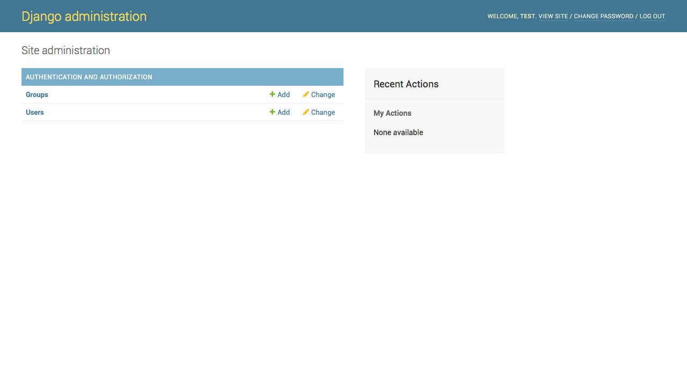

這就是 Django 預設給我們的後台介面，為了讓我們先前新增的 models 也能出現在上面，我們需要修改 `stats/admin.py` 這一個檔案：

```python
from django.contrib import admin

from .models import Candidate, Vote, Region

# Register your models here.
admin.site.register(Candidate)
admin.site.register(Vote)
admin.site.register(Region)
```

存檔後重新整理剛剛的 admin 網頁，你就會看到你自己定義的 models（資料表）出現在上面，並且可以做簡單的新增修改。

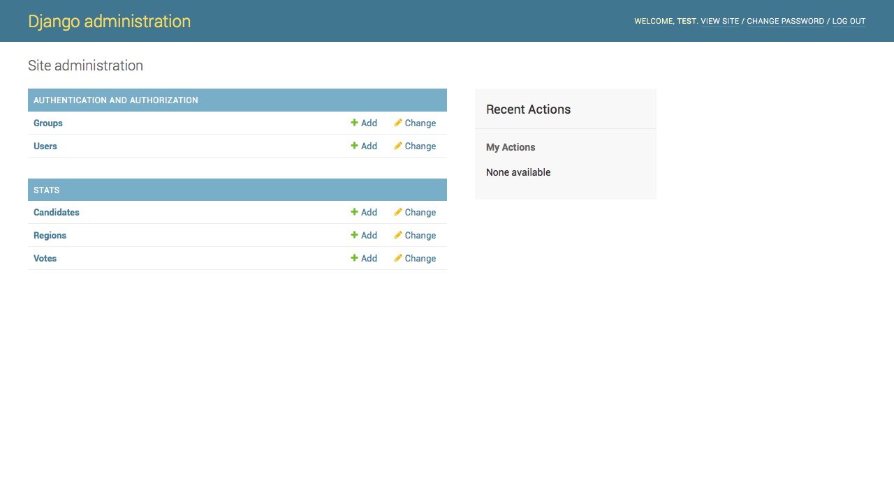

這一個後台系統已經能滿足最基本的需求，你也可以根據需求自己修改這個後台的樣子，或是加入一些額外的功能，在這裡我們就先不更動它，如果你有需要的話可以參考 [這裡](https://docs.djangoproject.com/en/1.9/ref/contrib/admin/)。

> **Note**
>
> 修改完 stats/admin.py 後存檔，你會發現你不需要重新 `runserver` 就能看到更新後的結果，這是因會 Django 的測試伺服器會自動偵測有沒有檔案被修改，如果有的話會自動重啟。如果你不是用 Django 的開發伺服器的話，你可能會需要自己手動重啟你的 server 程式（例如 Nginx or Apache）。

## d5. ORM, Querysets and Django Shell

接下來我們要透過 Django 的 interactive shell 來玩玩看我們的資料 models，這個跟 Python 的 interactive shell 其實是同樣的概念，你可以先透過這個互動環境來測試你的程式碼正不正確，運行 `python manage.py shell` 開啟互動介面。

> **Note**
> 
> 你也可以不使用 manage.py 來使用 Django 的功能，首先把 `DJANGO_SETTINGS_MODULE` 環境變數設為 `mysite.settings`，然後再執行 `import django; django.setup()` 即可。這個功能同時可以方便你在撰寫 script 時使用 django 的功能。（塞假資料的時候也很方便）
>
>```python
import os, django
os.environ['DJANGO_SETTINGS_MODULE'] = 'mysite.settings'
django.setup()
>```

```python
# Import 你自己的 models

In [1]: from stats.models import Vote, Region, Candidate

# 查詢 Candidate 資料表中所有的資料

In [2]: Candidate.objects.all()
Out[2]: []

# 建立一個新的 Candidate object

In [4]: new_candidate = Candidate(candidate_name='WuWuLaLa', candidate_gender='male', candidate_age=30)

In [5]: new_candidate
Out[5]: <Candidate: Candidate object>

# 將 new_candidate 存入資料庫（Create in CURD)

In [6]: new_candidate.save()

# 使用物件的方式來操作資料 (Read in CURD)

In [7]: new_candidate.id
Out[7]: 1

In [8]: Candidate.objects.all()
Out[8]: [<Candidate: Candidate object>]

In [9]: Candidate.objects.all()[0].candidate_name
Out[9]: 'WuWuLaLa'

In [10]: Candidate.objects.all()[0].candidate_gender
Out[10]: 'male'

In [11]: Candidate.objects.all()[0].candidate_age
Out[11]: 30

In [12]: Candidate.objects.all()[0].register_date
Out[12]: datetime.datetime(2016, 2, 19, 6, 29, 26, 530009, tzinfo=<UTC>)

# filter 條件式查詢 (Read in CURD)

In [13]: Candidate.objects.filter(id=1)
Out[13]: [<Candidate: Candidate object>]

In [14]: Candidate.objects.filter(id=1)[0]
Out[14]: <Candidate: Candidate object>

In [15]: Candidate.objects.filter(id=1)[0].candidate_name
Out[15]: 'WuWuLaLa'

# 這一個有點像 SELECT * FROM `Candidate` WHERE `candidate_name` = 'LaLaWuWu';

In [4]: Candidate.objects.filter(candidate_name='LaLaWuWu')
Out[4]: [<Candidate: LaLaWuWu>]

# 更新資料內容 (Update in CURD)

In [16]: c = Candidate.objects.filter(id=1)[0]

In [17]: c
Out[17]: <Candidate: Candidate object>

In [18]: c.candidate_name
Out[18]: 'WuWuLaLa'

In [19]: c.candidate_name = 'LaLaWuWu'

In [20]: c.save()

In [21]: Candidate.objects.filter(id=1)[0].candidate_name
Out[21]: 'LaLaWuWu'
```

如果你不想要 `print` 時印出奇怪的 object 字串的話，可以在 models 中定義 `__str__` 方法：

```python
class Candidate(models.Model):
    # ...those fields here...

    def __str__(self):
        return self.candidate_name
```

設定完之後，你在 print 的時候就會是你設定的樣子：

```python
In [2]: Candidate.objects.all()
Out[2]: [<Candidate: LaLaWuWu>]
```

針對 ForeignKey， django 也提供了很方便的操作方式：

```python
# 先新增幾個 Region

In [7]: r = Region(region_name='Taipei')

In [8]: r
Out[8]: <Region: Taipei>

In [9]: r.save()

In [12]: r2 = Region(region_name='Tainan')

In [13]: r2.save()

In [14]: r3 = Region(region_name='Kaohsiung')

In [15]: r3.save()

# 新增幾個 Vote

In [19]: c = Candidate.objects.filter(id=1)[0]

In [21]: v = Vote(candidate=c, region=r)

In [22]: v
Out[22]: <Vote: LaLaWuWu, Taipei>

In [23]: v.save()

# 也可以使用 Model.objects.create(...) 來新增資料
# create 會自動幫你把資料 INSERT 進資料表，並回傳該新資料的物件

In [24]: Vote.objects.create(candidate=c, region=r2)
Out[24]: <Vote: LaLaWuWu, Tainan>

In [25]: Vote.objects.create(candidate=c, region=r3)
Out[25]: <Vote: LaLaWuWu, Kaohsiung>

In [26]: Vote.objects.create(candidate=c, region=r)
Out[26]: <Vote: LaLaWuWu, Taipei>

In [27]: Vote.objects.create(candidate=c, region=r)
Out[27]: <Vote: LaLaWuWu, Taipei>

# ForeignKey 的反向查詢（從 Region 物件查詢連結他的 Vote 物件）

In [35]: r = Region.objects.filter(region_name='Taipei')[0]

In [54]: r
Out[54]: <Region: Taipei>

In [55]: r.vote_set.all() # 這邊我有自己新增一些其他的 Vote
Out[55]: [<Vote: LaLaWuWu, Taipei>, <Vote: LaLaWuWu, Taipei>, <Vote: LaLaWuWu, Taipei>, <Vote: WuLa, Taipei>, <Vote: WuLa, Taipei>]

In [56]: r.vote_set.count()
Out[56]: 5

# 查詢某些名字的候選人在這一個區域的得票數
# 這個地方 filter 裡面的查詢條件看起來有點奇怪，他的結構是像這樣子的：
# .filter(<ForeignKey field of this object>__<field of the ForeignKey object>='條件')

In [57]: r.vote_set.filter(candidate__candidate_name='WuLa')
Out[57]: [<Vote: WuLa, Taipei>, <Vote: WuLa, Taipei>]

In [60]: r.vote_set.filter(candidate__candidate_name='WuLa').count()
Out[60]: 2

In [58]: r.vote_set.filter(candidate__candidate_name='LaLaWuWu')
Out[58]: [<Vote: LaLaWuWu, Taipei>, <Vote: LaLaWuWu, Taipei>, <Vote: LaLaWuWu, Taipei>]

In [59]: r.vote_set.filter(candidate__candidate_name='LaLaWuWu').count()
Out[59]: 3
```

Django 提供了各式各樣的資料操作介面，在這邊只介紹了一些常用的操作，通常我們會需要查文件來找到我們想要的查詢方法，詳情可以參考[這裡](https://docs.djangoproject.com/en/1.9/topics/db/queries/)。

你可以回到 Django admin 後台看看自己剛剛新增的各種資料：

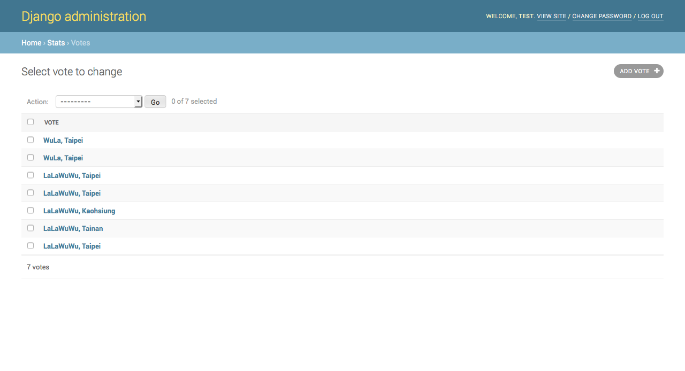

## d6. 懷念 SQL 嗎？

django 仍然保留了 SQL 的查詢方法：

```python
In [5]: for c in Candidate.objects.raw('SELECT * FROM stats_candidate'):
    print(c)
   ...:     
LaLaWuWu
WuLa

In [6]: for c in Candidate.objects.raw('SELECT * FROM stats_candidate WHERE candidate_name="WuLa"'):
    print(c)
   ...:     
WuLa
```

當你想要用 raw SQL 的時候一定要非常小心 SQL injection 的問題，詳細的用法可以參考[這裡](https://docs.djangoproject.com/en/1.9/topics/db/sql/)。

如果可以用 QuerySet 就用 QuerySet 吧，會減少你很多麻煩的 (´Д` )。

## d7. Model 小結（Another time to break）

在這一個章節裡我們快速地瀏覽過 django model 的用法，這是一種抽象化、物件化的資料操作方法，不但減少了設計 SQL 的麻煩，也讓我們不需要針對不同資料庫設計不同的 SQL 或程式碼。

剛從 SQL 的世界進入到這種操作方法可能會很不習慣，但多練習幾次之後你會發現他非常的方便。

接下來的章節我們會介紹如何把 view 和 model 結合在一起。

<!--====  End of Model  ====-->


<!--==========================
=            View            =
===========================-->
# E. View 動態網頁的基礎

在 django 中，網頁程式中的每一個網頁（或者不同的功能）都是由 view 來產生，以一個 blog 網站來說，可能會包含以下的 views，來顯示不同的頁面或者處理不同的功能：

- 首頁：顯示一些最新的文章
- 文章內容：顯示該文章的內容
- 文章列表：依據不同條件顯示文章
- 新增文章：編輯、新增文章
- 留言：針對不同文章留言
- 使用者認證：登入登出功能

究竟一個網站需要多少 views，這個就與你的程式設計跟需求有關了。

另外 django 會透過 URLConf 的設定來決定該呼叫哪一個 view function 來處理，這就跟我們過去會在 www 資料夾內放入各種不同的 HTML 或 PHP 檔一樣，在 django 中他幫你建構了一個統一、有秩序的流程來處理不同的頁面，你不再需要自己管理雜七雜八的網頁檔。

還記得在前面的章節我們撰寫過一個最基本的 view 嗎？現在我們要多加幾個新的 view ，並連結我們新學到的 models。

> **Note**
>
> 撰寫一個 view 的流程大概是：寫 view -> 修改 URLConf -> 寫 view -> 修改 URLConf -> ......

開啟 `stats/views.py` ，並加入以下的程式碼：

```python
# Other code above...

def candidate(request, candidate_id): # 這裡的參數將會從 URLConf 解析而來
    """ Show the details of candidate
    """
    return HttpResponse("You are watching the details of candidate <b>{id}</b>".format(id=candidate_id))

def region(request, region_name):
    """ Show the vote results of one region
    """
    return HttpResponse("You are watching the details of region <b>{name}</b>".format(name=region_name))
```

接著在 `stats/urls.py` 加入：

```python
# Other code above...

urlpatterns = [
    
    # Other urls ......

    # ex: /stats/candidate/{id}/
    url(r'^candidate/(?P<candidate_id>[0-9]+)/$', views.candidate, name='candidate'),
    # ex: /stats/region/{name}/
    url(r'^region/(?P<region_name>[a-zA-Z]+)/$', views.region, name='region'),
]
```

`runserver` 後在瀏覽器嘗試看看以下的網址，看看結果為何：

```
http://127.0.0.1:8000/stats/candidate/10/
http://127.0.0.1:8000/stats/candidate/8/
http://127.0.0.1:8000/stats/region/Taipei/
http://127.0.0.1:8000/stats/region/Tainan/
http://127.0.0.1:8000/stats/region/12345/
```

有發現嗎？我們可以透過 URLConf 的設計，讓 view function 取得對應的參數，接著我們就能夠依據不同的參數動態顯示不同的結果！

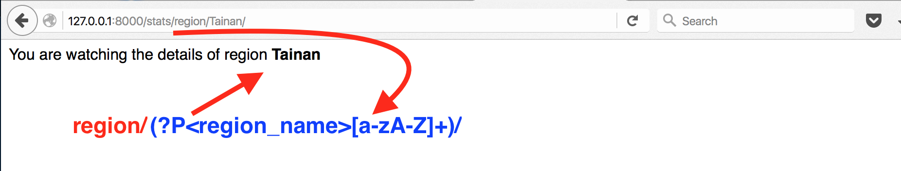

## e1. URLConf 的 regular expression（補充）

Regular expression, regex 正則表達式是一種常用的「字串搜尋」方法，透過預先定義的符號，我們可以檢查任何字串是不是有符合某種規則。

regex 還滿好用的，建議花一點時間學習一下。

[參考資料](https://docs.python.org/3.4/howto/regex.html)

## e2. 連結資料庫

接下來我們要讓 view 能夠執行一些比較有用的功能，例如顯示候選人資料、投票結果，或者在使用者鍵入不合法的 URL 時顯示錯誤訊息。

從 view 裡面抓取資料庫的方法同樣是使用 models，接下來我們要讓 views 能夠在接收到不同的參數時，從資料庫中提取對應的資料，並在找不到資料時引發 404 錯誤：

```python
from django.http import Http404       # import Http404 這一個 exception

from .models import Candidate, Region, Vote

# Create your views here.

def index(request):
    """ Show the index page
    """
    # 從資料庫中抓取 Candidate 和 Rrgion 的資料

    candidate_list = Candidate.objects.all()
    region_list = Region.objects.all()

    # 製作 response content

    response = "Candidates: {clist} <br>Regions: {rlist}".format(
        clist=', '.join([c.candidate_name for c in candidate_list]), 
        rlist=', '.join([r.region_name for r in region_list]))

    return HttpResponse(response)

def candidate(request, candidate_id): # 這裡的參數將會從 URLConf 解析而來
    """ Show the details of candidate
    """
    try:
        c = Candidate.objects.get(id=candidate_id)
    except Candidate.DoesNotExist:    # 在找不到資料時引發 404 錯誤
        raise Http404('Candidate of id {id} does not exist.'.format(id=candidate_id))

    return HttpResponse("{name}, {gender}, {age}".format(
        name=c.candidate_name,
        gender=c.candidate_gender,
        age=c.candidate_age))

def region(request, region_name):
    """ Show the vote results of one region
    """
    try:
        r = Region.objects.get(region_name=region_name)
    except Region.DoesNotExist:     # 在找不到資料時引發 404 錯誤 
        raise Http404('Region of name {name} does not exist.'.format(name=region_name))

    return HttpResponse("Region: {name}".format(name=r.region_name))
```

完成之後，一樣 `runserver` ，並測試看看你的網頁程式能不能夠正確運作：

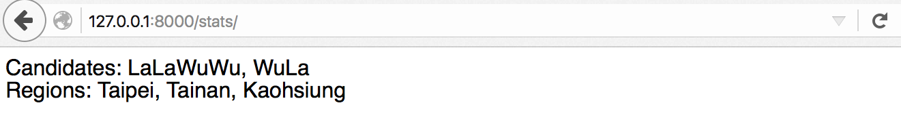
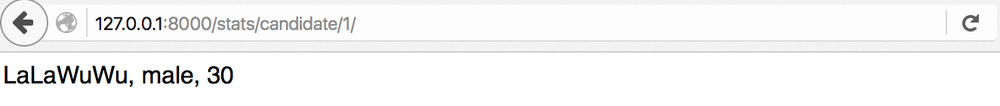
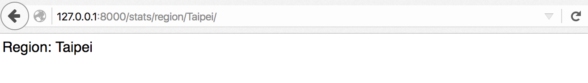

在找不到資料的時候會顯示 404 錯誤頁：

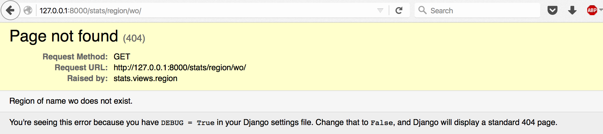

## e3. Django views 運作流程圖例


- .... Same as above illustration
- [Djengo-app] Interprete the request URL by app's URLConf
- [Django-app] URL matches, redirect to the specified view function
- [Django-view] Passes the request to the matched view function
- [Django-view] view function will return the parsed HTTP response
- [Django] Send the response to the host server
- [Server] Send the response back to the client
- [Client] See "Hello world!"

## e4. View 小結（10 mins break and we'll back）

在這一個章節我們看到了要怎麼樣透過 URL 來傳遞參數給 view，並透過 models 來搜尋到我們想要的資料，並顯示在網頁上。

到了這邊你大概能夠理解 django 的網頁程式大概是怎麼運作的了吧？

不過我們發現到，只是回傳一個「字串」到網頁上非常的不足，甚至有些人會覺得那根本不能算是一個網頁（畢竟連 html 標籤都沒有），在接下來的章節我們將看到 django 中非常強大的一個功能：template，透過 HTML 與 template language 的結合，我們就能夠讓 django 顯示出我們平常所見的網頁樣式，還能夠動態地修改網頁的內容。

<!--====  End of View  ====-->


<!--==============================
=            Template            =
===============================-->
# F. Template 網頁的骨架

在 django 的 MTV 中，model 負責資料的模型化，view 負責運行邏輯，而 template 負責的是「呈現」。

template 系統讓 django 在送出 HTTP response 之前，把資料和我們預先寫好的模板結合，就像填表格一樣，把資料庫中的資料一個一個填入預先設計好的格式中。

如果你曾經寫過單純的 PHP，應該對下面這段程式碼非常熟悉：

```php
<ul>
<?php
$data = array('1', '2', '3', '4', '5');

foreach ($data as $value) {
    echo "<li>$value</li>\n";
}
?>
</ul>
```

這樣的設計方式還有一個好處，他讓程式的邏輯可以跟呈現給使用者的介面設計分開。

我們不需要再 Python code 中去管介面設計的元素，介面設計也不需要管 Python 的邏輯怎麼樣跑，Python 端只要告知介面端該用哪些變數來取得資料，介面端就可以完全依照自己的設計理念去發揮。

這麼做除了讓程式設計師與介面設計師不再打架外，也帶來了維護上的好處。今天無論是要修改介面還是要修改程式邏輯，都可以在不影響到對方程式碼的情況下進行修改（當然你要維持介面的一致），大大的減少了維護的成本。

要在 app 中加入 template ，首先你需要在 app 資料夾中建立像下面這個範例的資料夾結構：

```
stats
├── templates     <-- 建立一個 templates 資料夾
│   └── stats     <-- 再建立一個與 app 同名的資料夾
├── urls.py
├── views.py
└── # ... other files
```

你的 template 檔案都要放在 `<project>/<app>/templates/<app>/` 這一個資料夾底下， django 才有辦法找到他們。

> **Note**
>
> 為什麼需要在 templates 下再建立一個與 app 同名的資料夾呢？
>
> 這是避免「命名衝突」的考量，當你指定要某一個 template 檔案時， django 預設會去搜尋在 `INSTALLED_APPS` 中列出的每一個 app 資料夾底下的 `templates`，並且使用「第一個找到的」 template 檔案。
> 
> 想像一個情況：你有兩個 apps 名為 app1 和 app2 ，這兩個 apps 都有名為 index.html 的 template 檔案，這時 django 到底要使用哪一個呢？答案是先找到先用，所以你有可能在 app2 中使用到 app1 的 index.html，或者是在 app1 中誤用到 app2 的 index.html。
>
> 因此你必須要在 templates 資料夾下再建立一個與 app 同名的資料夾，並在引用 template 時加入 app 的名稱，來避免混淆。

## f1. HTML

究竟 template 檔案應該要長什麼樣子呢？基本上是沒有硬性規定的，但是通常為了方便我們會使用 HTML 來寫（畢竟是網頁嘛）。

接下來我們就來撰寫幾個 templates 吧。

在 `stats/templates/stats/` 下建立 index.html，並填入以下的內容：

```django
<!DOCTYPE html>
<html lang="en">
<head>
  <meta charset="UTF-8">
  <title>Index</title>
</head>
<body>
  <h1>Candidates</h1>
  
    <ul>
      
        <li><a href="/stats/candidate/{{i.id}}"></a></li>
      
    </ul>
  
    <p>There is no candidates found.</p>
  

  <h1>Region</h1>
  
      <ul>
        
          <li><a href="/stats/region/{{i.region_name}}"></a></li>
        
      </ul>
  
      <p>There is no region found.</p>
  
</body>
</html>
```

再來我們要修改 views.py 中的 index function ，讓他抓取我們指定的 template：

```python
from django.template import loader    # import template loader

def index(request):
    """ Show the index page
    """
    # 從資料庫中抓取 Candidate 和 Rrgion 的資料

    candidate_list = Candidate.objects.all()
    region_list = Region.objects.all()

    # 取得我們要用的 template 檔案
    # 注意：檔案的路徑要包含 templates 資料夾內的子資料夾的名稱

    template = loader.get_template('stats/index.html')

    # 我們想要傳進 template 的資料要用一個 dictionary 包起來，
    # dict 的 key 就會是你能夠在 template 中使用的變數名稱
    
    context = {
        'candidate_list': candidate_list, 
        'region_list': region_list
    }

    # 用 template.render 把資料塞入 template 後，
    # 再包進 HttpResponse 內回傳

    return HttpResponse(template.render(context, request))
```

`runserver` 後讀取我們的首頁，結果如下：

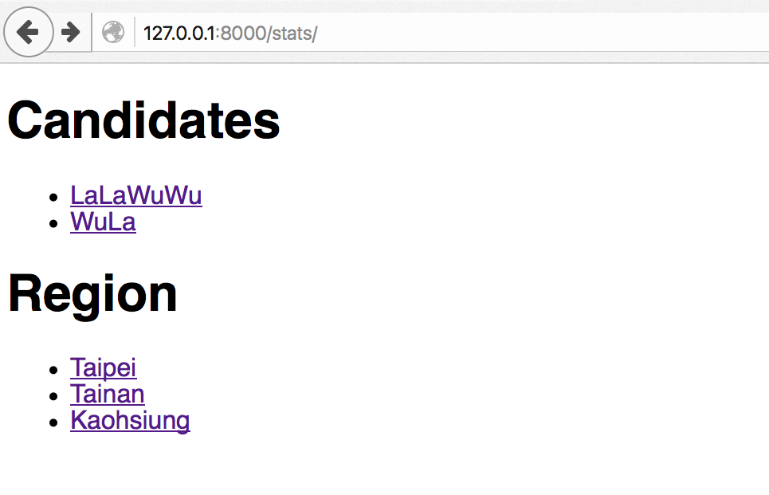

## f2. Django Template Language

在上面的範例中，你會發現某一些使用 `` 或是 `{{ }}` 夾起來的內容，那就是 django 的 template language，使用的方法有點像 PHP 裡面的 `<?php ?>` ， django 的 template 系統只會解析這兩種符號夾起來的內容，其他的部分就維持原樣。

用 `` 夾起來的是「流程控制」類的 template language，包含了經常使用的 for 迴圈、if-else 條件判斷式，語法上和 Python 相當接近。

而使用 `{{ }}` 包起來的是「變數」，在裡面直接放入變數名稱， django template 就會將他置換成對應的變數值，而變數的來源就是我們在 view 裡面指定的 dict。

Template language 還有很多其他的用法，可以參考 [這裡](https://docs.djangoproject.com/en/1.9/topics/templates/#syntax) 。

## f3. Shortcut: render()

因為 template 實在是太常用了， django 提供了一個 view 的簡化寫法：

```python
from django.shortcuts import render

def index(request):
    """ Show the index page
    """
    # 從資料庫中抓取 Candidate 和 Rrgion 的資料

    candidate_list = Candidate.objects.all()
    region_list = Region.objects.all()

    # 我們想要傳進 template 的資料要用一個 dictionary 包起來，
    # dict 的 key 就會是你能夠在 template 中使用的變數名稱
    
    context = {
        'candidate_list': candidate_list, 
        'region_list': region_list
    }

    # 使用 shortcut 中的 render function 來處理 template

    return render(request, 'stats/index.html', context)
```

通常我們會用這一種寫法，能懶則懶嘛。

## f4. Removing hardcoded URLs in our templates

在 template 中寫死其他地方的連結並不是一個好主意，當你哪天心血來潮想要修改 URL 時會造成很多的問題。

django template 中有提供「動態抓取」URL 的方法，使用 URLConf 中 url 的 `name` 即可抓到對應的 URL：

In your urls.py

```python
# ex: /stats/candidate/{id}/
url(r'^candidate/(?P<candidate_id>[0-9]+)/$', views.candidate, name='candidate'),
# ex: /stats/region/{name}/
url(r'^region/(?P<region_name>[a-zA-Z]+)/$', views.region, name='region'),
```

In index.html

```django
<!-- Other code -->

  <!-- 注意，你不需要使用 {{ }} 來取得變數，直接放在 URL name 的後面即可 -->
  <li><a href="">{{i.candidate_name}}</a></li>

<!-- Other code -->
```

請參考 [這裡](https://docs.djangoproject.com/en/1.9/intro/tutorial03/#removing-hardcoded-urls-in-templates)

## f5. Javascript 要怎麼辦？（補充）

這邊是做一個小補充，怕有些人不太明白 JavaScript 要怎麼跟 django template 一起使用。

JavaScript 是在「客戶端」執行的程式碼，也就是說 django template 基本上不會管你的 JavaScript 裡面寫了什麼，他只會處理他看得懂的那幾個符號。

所以你如果要在 template 中寫入 JavaScript，就直接寫吧！

不過，有時候我們的 JavaScript 「可能」會需要用到和 django template 相衝突的符號（例如 AngularJS），這個時候該怎麼辦呢？

最方便的做法就是「讓 django template 跳過那些可能會有衝突的程式碼」，語法如下：

```django

    包含在這兩個標籤內的程式碼不會被 django template 解析

```

## f6. Template 小結（Break time!）

在這一個章節裡面我們簡單看過了怎麼樣透過 template 來「美化」我們的網頁，將 Python 程式邏輯與介面設計分開能夠幫助我們解決開發上的合作問題與維護問題。

然而，我們的網頁好像還不是這麼「美」，我們接下來需要一些 CSS 檔來美化我們的網頁。

在 django server 中， CSS 、 JavaScript 或者圖片檔等都被稱為 static files，這些檔案是由 django 統一進行管理的，因此在使用時和過去我們直接指定圖片、CSS 或 JavaScript 檔案路徑的方式有很大的不同，在下一個章節我們將介紹如何處理這些檔案。

<!--====  End of Template  ====-->


<!--==================================
=            Static Files            =
===================================-->
# G. 處理 CSS 檔案 (static files)

在這一個章節將會介紹如何在 django 中處理 static files，我會以 CSS 為例。

如果你的專案很小，那你可以選擇把 static files 放在任何地方，只要你找得到就好。

但如果你的專案非常龐大，散亂各地的 static files 是非常難以管理的，好在 django 提供了一個機制來統一管理 static files。

首先，在你的 app 資料夾下建立 static 資料夾，並在 static 資料夾下建立與 app 同名的資料夾（和 templates 是一樣的概念）：

```
stats
├── ...other files
├── models.py
├── static <------------- 建立 static 資料夾
│   └── stats <---------- 建立與 app 同名的資料夾
├── templates
│   └── stats
│       └── index.html
├── tests.py
├── urls.py
└── views.py
```

## g1. 套用 Bootstrap

在這裡我們使用現成的 Bootstrap CSS 檔。

我們把 CSS 檔案放入 stats/static/stats/ 資料夾底下，接著在 index.html 中的 head 標籤加入引用 CSS 檔的程式碼：

```django

<!-- ... -->
<head>
  <link rel="stylesheet" type="text/css" href="">
</head>
<body>
  <!-- ... -->
  <script src=""></script>
  <script src=""></script>
</body>
```

接著你就可以 `runserver` 看到引入 CSS 後的效果（當然你需要自己改一下 index.html 的內容，加入 Bootstrap 的元素）：

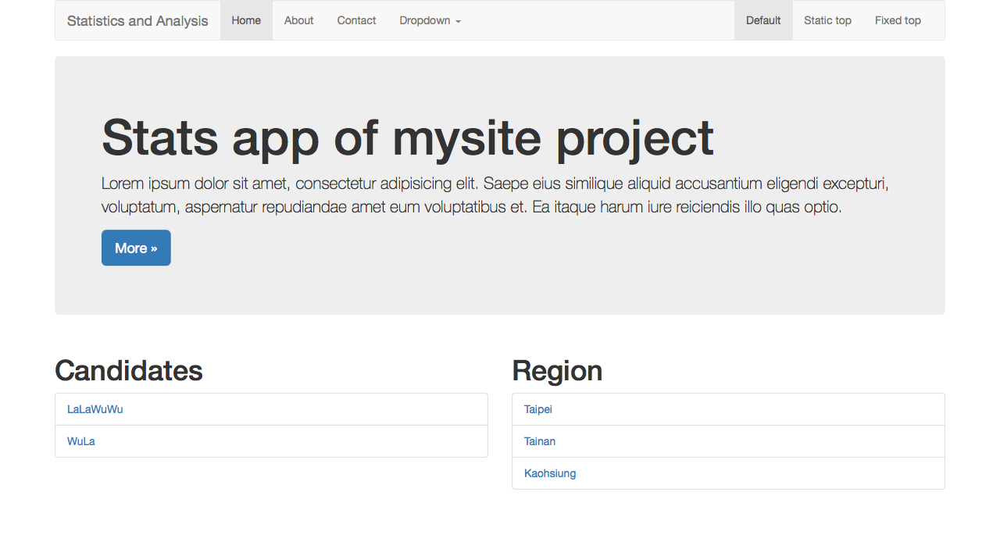

> **Note**
>
> 在真正部署系統的時候，你還會需要透過 django 指令將這些 static files 進行某些處理，在 [這邊](https://docs.djangoproject.com/en/1.9/howto/static-files/) 有詳細的解釋 static files 的管理方法。

<!--====  End of Static Files  ====-->


# H. Django 提供的其他功能

## h1. 處理 POST, GET 資料

在 view 裡面要處理 POST、GET 的資料非常容易，這些資料被以 dict 的方式分別儲存成 `request.GET` 和 `request.POST`，你可以直接在 view 中使用它們：

```python
# 取得 GET 資料
get_data = request.GET

# 取得 POST 資料
post_data = request.POST
```

```django
<h1>GET data list</h1>

  <p>{{key}} ---> {{value}}</p>

```

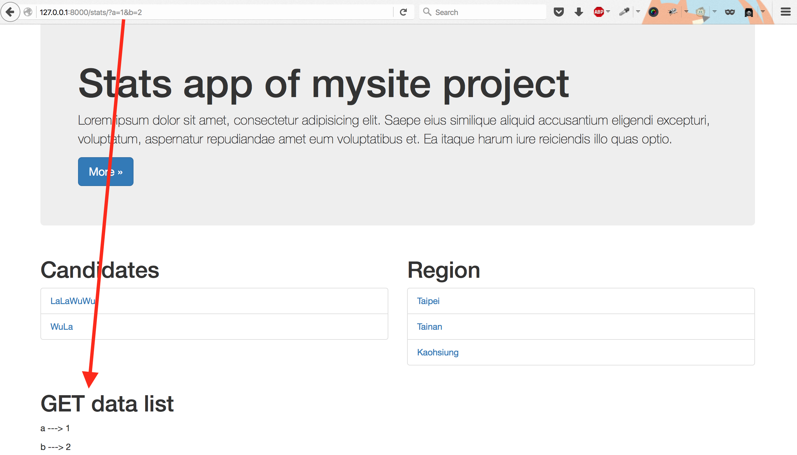

## h2. Django 表單

知道怎麼樣處理 POST 資料後，我們就可以來建立一個簡單的表單，同樣在 index.html 內加入一些程式碼：

```django
<h1>A simple form here</h1>

<!-- 在發生錯誤時顯示錯誤訊息 -->


  <p><strong>{{ error_message }}</strong></p>


<form action="" method="post">
  <!--  CSRF token（Cross Site Request Forgeries）
    這是要在 django 的環境下建立表單必須要加的一段描述，
    是一種安全機制。

    如果你的表單裡沒有這一個描述，django 會拒絕接收這個表單。
  -->
  
  <label for="title">Title</label>
  <input type="text" id="title" name="title">
  <input type="submit" name="submit" value="submit" />
</form>
```

在 views.py 中放入相對應的處理程式碼：

```python
# Other imports ......
from django.http import HttpResponseRedirect    # 重新導向用
from django.core.urlresolvers import reverse    # 透過 name 取出 URL

def index(request):
    """ Show the index page
    """

    # 我們在這裡處理 POST 過來的資料

    error_message = None
    success_message = None
    if 'submit' in request.POST:
        title = request.POST['title']

        # 通常你會需要做一些檢查清洗使用者輸入的資料

        if len(title) == 0:
            error_message = 'You should input something.'
        else:

            # 使用 HttpResponseRedirect 可以把使用者重新導向到其它頁面
            # 通常在成功接收 POST 之後建議用重新導向的方式，避免使用者
            # 不小心重新整理網頁造成重送的問題
            
            # reverse 是用來取得 URLConf 內的 URL 的一種方式，避免 hard code

            return HttpResponseRedirect(reverse('show_title', args=(title, )))

    # Other code here......

    context = {
        'candidate_list': candidate_list, 
        'region_list': region_list,
        'get_data': get_data,
        'error_message': error_message,
    }

    # 使用 shortcut 中的 render function 來處理 template

    return render(request, 'stats/index.html', context)
```

在這裡我們新增了一個新的 view 專門來顯示使用者輸入的結果（這方法是有點笨，不過很容易看得出效果 ( ´ ▽ ` )）：

```python
# In urls.py
url(r'^show_title/(?P<title>[a-zA-Z]+)/$', views.show_title, name='show_title'),

# In views.py
def show_title(request, title):
    return render(request, 'stats/show_title.html', {'title': title})
```

```django
<!-- In stats/templates/stats/show_title.html -->
<p>We got your message: {{title}}</p>
<a href="">Back to home</a>
```

`runserver` 後看看結果吧！

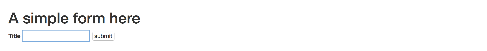

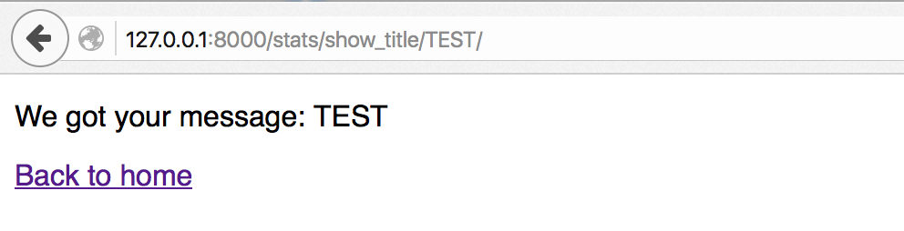

> **Note**
>
> 在 django 裡面其實有提供一個 form 的功能，透過這個功能來建立表單的話，django 可以自動清洗資料並幫我們檢查使用者輸入的資料正不正確，不過這個功能要介紹的話可能篇幅太長了，有興趣的人可以看看 [這裡](https://docs.djangoproject.com/en/1.9/topics/forms/)。


## h3. 使用者認證機制

Django 帶有一個很好用的使用者認證機制，在大多數的情況下，你不需要自己花時間寫一個使用者認證系統。與 django 中其他資料相同，每一個使用者都是一個 User 物件，可以用以下的方法去創建一個新的使用者：

```python
In [1]: from django.contrib.auth.models import User

In [2]: user = User.objects.create_user('foo', 'foo@foo.com', 'foopassword')

# 到這邊時使用者已經建立好了
```

接下來看看怎麼樣把使用者登入，我們可以透過 django 的 authenticate 和 login function：

```python
from django.contrib.auth import authenticate, login

# In your view function

def your_view_function(request):
  username = request.POST['username']
  password = request.POST['password']

  user = authenticate(username=username, password=password)

  if user is not None:
    if user.is_active:
        # 使用 login function 來把使用者登入（request 是來自於你 view function 傳入的參數）
        login(request, user)
        # 登入成功，將使用者導入成功頁面
    else:
        # 如果 user is not active，代表這個帳戶目前無法使用
        # 可以在這邊顯示錯誤訊息
  else:
      # 顯示登入失敗的錯誤訊息
```

如果想把使用者登出：

```python
from django.contrib.auth import logout

def logout_view(request):
  logout(request)
  # 將使用者導去登出成功的網頁
```

### 檢查使用者是否已經登入

有時候（應該說很多時候）我們會希望使用者先登入後才能使用某些功能（view），傳統的做法我們會需要做一些 if-else 的檢查，看看使用者是不是已經登入，但這個做法要在每一個需要檢查的 view 中增加程式碼，相當的麻煩。

在 django 裡面提供了一個很方便的做法，使用 login_required decorator，讓使用者進入到某一個 view 時自動檢查是不是已經登入，如果沒有登入則將使用者導入適當的登入頁：

```python
from django.contrib.auth.decorators import login_required

@login_required(login_url='/accounts/login/')   # 使用 decorator 來改變 view 的行為
def your_view(request):
  # ...
```

如果使用者沒有登入但進入了 @login_required 的 view 時，會被強制導到 `login_url` 所指定的 URL ，例如 `http://127.0.0.1:8000/accounts/login/?next=/stats/`（當然你得在那個頁面寫一個登入介面），等待使用者登入完成後便會被重新導回原先的頁面。

> **Note**
>
> Django 的 auth 功能在官方的文件裡有專門開一頁來講，建議如果要用 django 做使用者認證功能的話可以先瀏覽一下，請看 [這裡](https://docs.djangoproject.com/en/1.9/topics/auth/)。

---

# 延伸閱讀

## WSGI

[化整為零的次世代網頁開發標準: WSGI](http://blog.ez2learn.com/2010/01/27/introduction-to-wsgi/)

## REST and RESTful

[什麼是REST跟RESTful?](https://ihower.tw/blog/archives/1542)

## Automated testing

在 django 裡面撰寫測試就跟在 Python 裡撰寫測試一樣重要，官方的教學文件裡面有專門一章來介紹要如何撰寫 django 的自動測試，請看 [這裡](https://docs.djangoproject.com/en/1.9/intro/tutorial05/)。

## 處理 URL 的命名衝突

與 template 命名相同，URL 也會有命名的衝突問題，在 django 官網的 tutorial 中有講到這個問題的解決方式，請參考 [這裡](https://docs.djangoproject.com/en/1.9/intro/tutorial03/#namespacing-url-names)。

## 把你的 Django 程式部署到網路上

這是我在 Django Girl 中看到的教學，他使用了 GitHub 來把 django project 部署到 PythonAnywhere 上，還滿有趣的，有興趣的人可以參考 [這裡](http://tutorial.djangogirls.org/en/deploy/index.html)。
