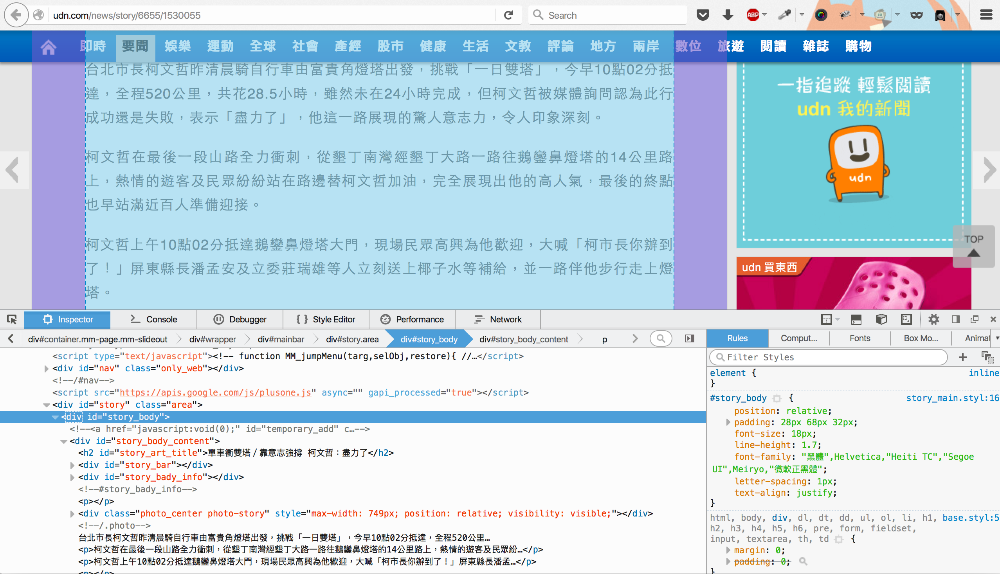
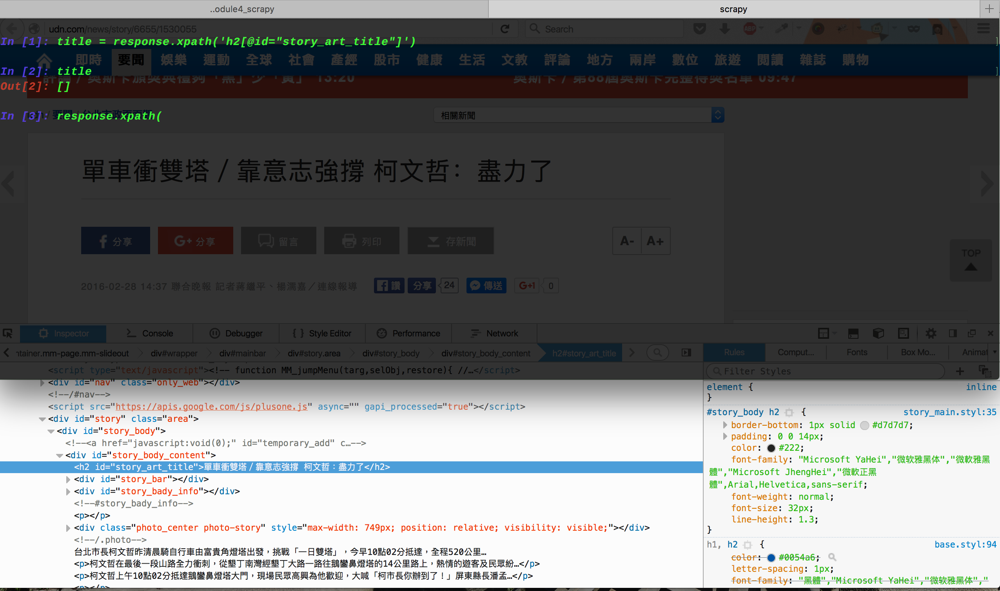
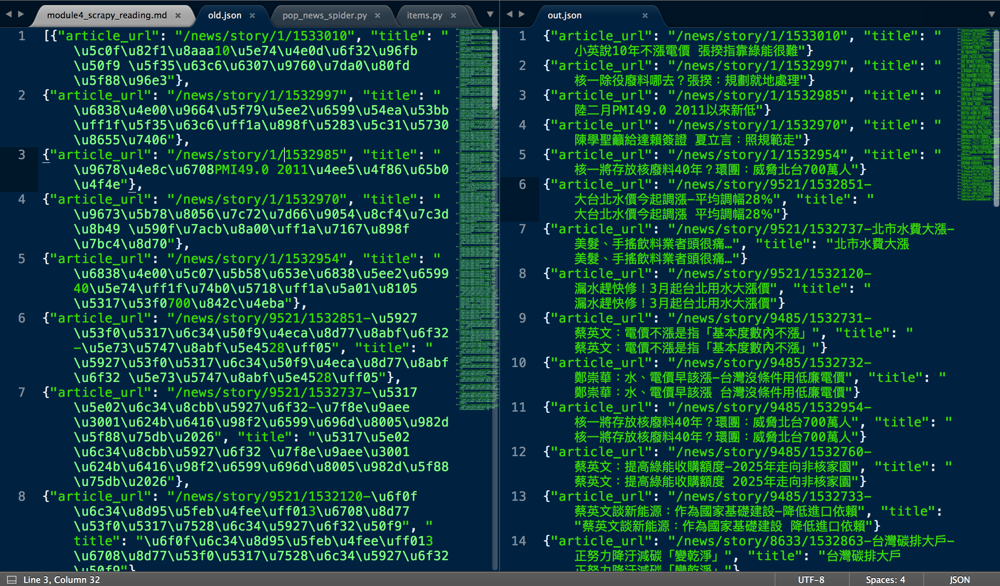
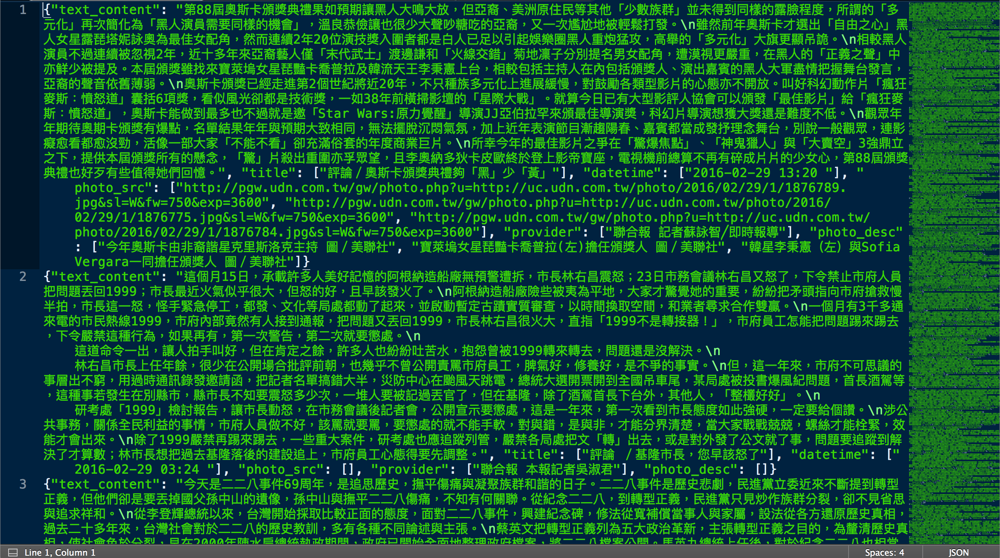

# Module 4 - Python Scrapy: Web Crawler and Data Processing

>（時間回到兩個月前，總統大選兩天後）
>
>老闆：誒，這次總統大選你怎麼看？
>
>你：就看電視啊。
>
>老闆：......我說你對這個局勢怎麼看？
>
>你：......我也不知道呢 ˊ_>ˋ
>
>老闆：哎，我們公司的產品受到政治影響很大呢，這次大選後很多地方的民意傾向都改變啦，我們得好好規劃一下未來我們的產品要怎麼賣，要賣到哪裡去。
>
>你：是的呢～
>
>老闆：哎，我想要瞭解一下全臺灣各個地區的投票結果是如何，然後做個分析。
>
>你：是的呢。
>
>老闆：現在請工讀生做這個要做多久啊？
>
>你：Hmmmmm 從網站找到資料，然後六都加起來好像有 150 多個區，市級有 10 多個區，然後還有 13 個縣，每縣有好幾個鄉鎮市，下面還有里，應該派十個工讀生每天做八個小時，一個禮拜可以做完吧 ˊ_>ˋ
>
>老闆：哦哦，好像還行啊。
>
>你：是啊是啊
>
>老闆：聽說你是資管系出來的吧，誒你去幫我搞定，一個禮拜後要。
>
>你：一個禮拜？老闆那是十個工讀生每天八個小時做一個禮拜啊。
>
>老闆：哎那不就是你一個月的薪水嗎？你資管系的，這個很簡單啦，交給你啦。
>
>你：ᶘ ᵒᴥᵒᶅ......

# 注意：由於當初我用來做教學的網站 404 了，所以這個教學會改用其他的網站做代替（所以跟上面的故事不一樣了 (´Д\` )）

## 學這堂課要幹麻

在 Web 2.0 以後，由使用者自行創建的資料開始充斥在網際網路上，新聞、社群網路、YouTube、blog 等等，對於從事社會科學、財經或者統計分析的人們來說，網路資料是一種低成本且非常值得研究的對象，另外網路資料對於現實現象的快速反應，在一定程度上也能夠反應一些社會現象。

早期的電子商務就已經瞭解到分析顧客資料能夠帶來的效益，而自從 Twitter、Facebook 之類的社群網路興起後，如何從顧客在社群中的互動、各種的貼文以及上傳中找出他們可能的購買行為也一直是廣告電商的兵家必爭之地。

在資訊爆炸的時代裡，我們不可能用人工的方式將資料一點一點複製貼上，因此如何透過程式去自動抓取我們想要的資料便成為一個資訊人員最基本也必需要擁有的能力之一。

## 學完這堂課你可以

- 了解網路爬蟲的基礎概念
- 了解如何使用 Python Scrapy 來撰寫網路爬蟲
- 如何綜合使用不同的工具來幫助我們爬取資料

## 課程大綱

* [Module 4 - Python Scrapy: Web Crawler and Data Processing](#module-4---python-scrapy:-web-crawler-and-data-processing)
  * [學這堂課要幹麻](#學這堂課要幹麻)
  * [學完這堂課你可以](#學完這堂課你可以)
  * [課程大綱](#課程大綱)
* [A. Overview: Websites data extraction](#a.-overview:-websites-data-extraction)
* [B. Scrapy: Python framework for extracting data from websites](#b.-scrapy:-python-framework-for-extracting-data-from-websites)
  * [b1. Installation with pip](#b1.-installation-with-pip)
    * [Python2 and Python3](#python2-and-python3)
    * [Install Python2](#install-python2)
    * [pip 安裝 Scrapy](#pip-安裝-scrapy)
  * [b2. Creating a Scrapy project](#b2.-creating-a-scrapy-project)
    * [Scrapy 的使用流程](#scrapy-的使用流程)
    * [建立 Scrapy 專案](#建立-scrapy-專案)
  * [b3. What do you want? Defining Items](#b3.-what-do-you-want?-defining-items)
  * [b4. Reading website using program: Writing the first spider](#b4.-reading-website-using-program:-writing-the-first-spider)
    * [結果](#結果)
    * [scrapy.Spider 的工作流程](#scrapy.spider-的工作流程)
  * [b5. Extracting data with XPath (and Scrapy shell)](#b5.-extracting-data-with-xpath-(and-scrapy-shell))
    * [Scrapy shell](#scrapy-shell)
    * [XPath 語法簡介](#xpath-語法簡介)
    * [XPath 操作流程](#xpath-操作流程)
  * [b6. Using your own Items](#b6.-using-your-own-items)
  * [b7. Output extracted data as CSV or JSON format](#b7.-output-extracted-data-as-csv-or-json-format)
    * [處理 JSON 的 Unicode 問題（自定義 JSON 輸出）](#處理-json-的-unicode-問題（自定義-json-輸出）)
  * [b8. Full code of the spider](#b8.-full-code-of-the-spider)
  * [b9. Summary](#b9.-summary)
* [C. Advanced topics](#c.-advanced-topics)
  * [c1. CrawlSpider: Following links by defining rules](#c1.-crawlspider:-following-links-by-defining-rules)
  * [c2. Summary](#c2.-summary)
* [延伸閱讀](#延伸閱讀)
  * [Item pipline](#item-pipline)
  * [關於 \_\_repr\_\_ 和 \_\_str\_\_](#關於-\_\_repr\_\_-和-\_\_str\_\_)
  * [NodeJS Web crawler/spider](#nodejs-web-crawler/spider)
  * [JavaScript 的問題](#javascript-的問題)
  * [你用 Python 做过什么有趣的数据挖掘项目？](#你用-python-做过什么有趣的数据挖掘项目？)

---

<!--========================================================
=            Overview: Websites data extraction            =
=========================================================-->

# A. Overview: Websites data extraction

在 Web 2.0 以後，由使用者自行創建的資料開始充斥在網際網路上，新聞、社群網路、YouTube、blog 等等，對於從事社會科學、財經或者統計分析的人們來說，網路資料是一種低成本且非常值得研究的對象，另外網路資料對於現實現象的快速反應，在一定程度上也能夠反應一些社會現象。

早期的電子商務就已經瞭解到分析顧客資料能夠帶來的效益，而自從 Twitter、Facebook 之類的社群網路興起後，如何從顧客在社群中的互動、各種的貼文以及上傳中找出他們可能的購買行為也一直是廣告電商的兵家必爭之地。

在資訊爆炸的時代裡，我們不可能用人工的方式將資料一點一點複製貼上，因此如何透過程式去自動抓取我們想要的資料便成為一個資訊人員最基本也必需要擁有的能力之一。

網路上其實有很多種 Python 網路爬蟲的實現方式，在這一堂課中我們會使用一個滿新（我覺得啦）的 Python framework: Scrapy。

<!--====  End of Overview: Websites data extraction  ====-->


<!--===================================================================
=            Scrapy: Elegent framework for data extraction            =
====================================================================-->

# B. Scrapy: Python framework for extracting data from websites

網路爬蟲已經是一個滿成熟的東西，有非常多的方案可以選擇，你可以用最古老的方法造一個輪子，也可以用別人幫你寫好的工具，各種方法之間各有優缺點，通常是依照你自己的需求去選擇啦。

Scrapy 是一套開源、基於 Python 的 web crawling framework，他非常的簡潔也非常的容易上手，只要你稍微了解 Python 以及 HTML 就可以撰寫一個簡單的爬蟲，另外 Scrapy 提供的 Scrapy shell 讓我們可以快速地測試爬蟲的規則，就像 Python 的互動式介面一樣。

Scrapy 幫你完成了 HTML request/response 的處理，並且預先定義了一套爬蟲的流程，從 HTTP 處理、內容解析到後處理跟資料儲存，我們只要把適當的程式碼填入適當的地方就可以了。

## b1. Installation with pip

### Python2 and Python3

最初的 Scrapy 是用 Python2 撰寫的，而 Python3 的版本目前還在開發當中。在這份教學裡面我們會 **採用 Python2 的 Scrapy** ，但基本上不會遇到太多版本差異的問題，我們仍然保留語法上的一致性（Python3），這邊列出幾個需要注意的差別：

```python
# -*- coding: utf-8 -*-
# 請在所有 script 的第一行加入上面這句，告訴 Python 要使用 UTF-8 來解讀這一個 script（詳細說明可以參考 module1）

# print 有時候用 Python3 的語法不會印出你想要的東西
print('hello, world')  # Python3
print 'hello, world'   # Python2 

# string format 我們用比較通用的語法
print('This will print: {mystr}'.format(mystr='hello world'))
```

### Install Python2

首先我們要安裝一下 Python2 ，這份教學裡面的程式碼都用 `Python 2.7.10` 的版本測試，如果你已經有 Python2 但是不是這一個版本也沒關係，大部分的情況下應該是可以跑的。

但因為我沒有在其他的平台上測試過，如果你用你的版本發生問題的話請在討論區發問，謝謝。

基本上 Python2 的安裝方式跟安裝 Python3 的方式一模一樣，Windows 版本可以在[這裡下載](https://www.python.org/downloads/release/python-2710/)，OSX 跟 Linux 通常會自帶。

### pip 安裝 Scrapy

在你的 cmd/terminal 中打入以下指令，為避免版本問題，指定使用 `pip2`：

```bash
$ pip2 install scrapy

# 注意，你的電腦可能會找不到 pip2 這一個指令，這時你可以直接去 Python2 的安裝路徑下找 pip 來使用（如果還是找不到的話可以發問）

# 另外你可以透過 pip --version 來確定你的 pip 到底是什麼版本的
$ pip --version
pip 7.1.0 from ....../python2.7/site-packages (python 2.7)
$ pip2 --version
pip 7.1.0 from ....../python2.7/site-packages (python 2.7)
$ pip3 --version
pip 8.0.2 from ....../python3.5/site-packages (python 3.5)
```

## b2. Creating a Scrapy project

### Scrapy 的使用流程

撰寫一支 Scrapy 爬蟲的步驟大概是這樣的：

1. 建立新的專案
1. 確定要抓的網站為何
1. 確定要用爬蟲存哪些資料
1. 分析目標網頁的結構
1. 撰寫爬蟲

就像使用 django 一樣，我們要先建立一個 Scrapy 的專案：

### 建立 Scrapy 專案

```bash
$ scrapy startproject news_website
```

```
news_website     <-- Project root folder
├── scrapy.cfg            <-- Scrapy 的部署設定檔
└── news_website <-- 爬蟲本體（Python package）
    ├── __init__.py 
    ├── items.py          <-- 用於定義要抓什麼資料
    ├── pipelines.py      <-- Item piplines，可以定義在抓到 Item 之後要做什麼處理
    ├── settings.py       <-- 這一隻爬蟲的設定
    └── spiders           <-- 用來放自己定義的爬蟲（Python package）
        └── __init__.py
```

## b3. What do you want? Defining Items

Scrapy 提供兩個最基本的功能來幫助我們建立網路爬蟲，第一個是自動化的 HTTP 網頁請求，另外一個則是自動的資料格式化。我們可以預先定義好想要儲存哪些資料，我們的爬蟲就可以彈性地指定不同格式來產生資料檔，例如 CSV 或 JSON。

Scrapy 專案內的爬蟲 package 中有一個 items.py ，有點像 django 的 models，在這一個檔案中我們可以建立適當的資料模型，來存放我們想抓的資料。

打開 items.py 並加入以下內容，別忘了第一行的 `# -*- coding: utf-8 -*-` ：

```python
# -*- coding: utf-8 -*-

import scrapy

class NewsWebsiteItem(scrapy.Item):
    """ Define what data is we want
    """
    title       = scrapy.Field()      # News title
    article_url = scrapy.Field()      # News URL
    author      = scrapy.Field()      # News author
    provider    = scrapy.Field()      # News provider
    datetime    = scrapy.Field()      # Uploaded time
    content     = scrapy.Field()      # Text content
    # ......
```

在套用我們自己定義的 Item 之前，我們先來看看要怎麼樣讓 Scrapy 自動去請求網頁資料。

## b4. Reading website using program: Writing the first spider

在 Scrapy 框架中，我們是透過擴充 Scrapy 預先定義的爬蟲類別來製作我們自己的爬蟲。

在 `news_website/spiders` 資料夾底下，新增 `pop_news_spider.py`：

```python
# -*- coding: utf-8 -*-

import scrapy

class PopNewsSpider(scrapy.Spider):   # scrapy.Spider 是最簡單最基本的爬蟲類別
    name = "pop_news_spider"          # 這是這隻爬蟲的名稱
    allowed_domains = ["udn.com"]     # 限制這隻爬蟲能夠訪問的 URL domains
    start_urls = [                    # 定義爬蟲該從哪一個網址開始，可以有很多個網址
        "http://udn.com/news/cate/6638",
    ]

    # parse 方法是 Scrapy 爬蟲類別裡最重要的方法之一，
    # scrapy.Spider 在透過 HTTP request 取回網頁原始碼後，
    # 便會呼叫 parse 來處理 HTTP response，在 parse 中可以
    # 非常自由地去處理抓回來的 HTML 程式碼

    def parse(self, response):        
        """ When response is received, this method will be called
        """

        # 在這裡我們直接把回傳的 HTML response 內容儲存成一個檔案

        filename = response.url.split("/")[-2] + '.html'
        with open(filename, 'wb') as f:
            f.write(response.body)
```

### 執行

接下來我們就可以試著透過 Scrapy 去運行剛剛寫好的 spider，通常會直接在專案的根目錄運行：

```bash
$ pwd                          # 確定你在專案的根目錄內
.../news_website
$ scrapy list                  # 顯示有哪些可用的 spiders
pop_news_spider
$ scrapy crawl pop_news_spider # 運行 pop_news_spider 這一支爬蟲
```

以下是運行結果（省略了一些細節），可以從這裡觀察 Scrapy 的運行狀況：

```
[scrapy] INFO: Scrapy 1.0.4 started (bot: news_website)
# ......
[scrapy] DEBUG: Crawled (200) <GET http://udn.com/news/cate/6638> (referer: None)
[scrapy] INFO: Closing spider (finished)
# ......
[scrapy] INFO: Dumping Scrapy stats:
# 這邊會有一些 Scrapy 關於這次執行的統計
{'downloader/request_bytes': 219,
 'downloader/request_count': 1,
 'downloader/request_method_count/GET': 1,
 'downloader/response_bytes': 13993,
 'downloader/response_count': 1,
 'downloader/response_status_count/200': 1,
 'finish_reason': 'finished',
 'finish_time': datetime.datetime(2016, 2, 29, 2, 7, 9, 259227),
# ......
[scrapy] INFO: Spider closed (finished)
```

### 結果

完成之後，我們可以看一下存下來的 .html 檔案，這個檔案是透過前面定義的 spider 儲存下來的：

```html
<!DOCTYPE HTML PUBLIC "-//W3C//DTD HTML 4.01 Transitional//EN" "http://www.w3.org/TR/html4/loose.dtd"><html><head><meta http-equiv="X-UA-Compatible" content="IE=edge,chrome=1"> 
<!-- ...... -->
```

### scrapy.Spider 的工作流程

1. 從 `start_urls` 內的網址開始
1. 準備 Request 物件
1. 執行 Request
1. 取得 Response
1. parse()

## b5. Extracting data with XPath (and Scrapy shell)

當然，只有單純的 HTML 程式碼似乎太過簡單了，我們可以在儲存之前先對 response 做一些處理， Scrapy 的好處是他已經幫你把 response 包成一個方便使用的物件，你只需要呼叫對應的方法就行。

### Scrapy shell

爬網頁資料時，會遇到每個網頁都有不同的寫法跟結構，因此清洗網頁資料往往需要非常多的測試跟嘗試，在 Scrapy 裡應用了 Python interactive shell 的好處，讓我們可以在 shell 裡面快速地試驗處理方法。

用 `scrapy shell <URL>` 可以開啟 Scrapy shell 並載入指定網頁的內容：

```bash
$ scrapy shell http://udn.com/news/cate/6638
# ......
2016-02-29 10:19:29 [scrapy] INFO: Spider opened
2016-02-29 10:19:29 [scrapy] DEBUG: Crawled (200) <GET http://udn.com/news/cate/6638> (referer: None)
[s] Available Scrapy objects:
[s]   crawler    <scrapy.crawler.Crawler object at 0x10a2cdf10>
[s]   item       {}
[s]   request    <GET http://udn.com/news/cate/6638>
[s]   response   <200 http://udn.com/news/cate/6638>
[s]   settings   <scrapy.settings.Settings object at 0x10b611b50>
[s]   spider     <PopNewsSpider 'pop_news_spider' at 0x10d41d990>
[s] Useful shortcuts:
[s]   shelp()           Shell help (print this help)
[s]   fetch(req_or_url) Fetch request (or URL) and update local objects
[s]   view(response)    View response in a browser
# 以下進入 Scrapy shell
```

### XPath 語法簡介

在這邊我們要介紹的是 XPath 這一個 XML 結構文件的處理函式，透過 `.xpath(pattern)` 的方式，我們可以很方便地取得一個 XML 文件中任何一個地方的資料。

- `response.xpath('//h2')`: 選擇「整個文件中」所有的 h2 節點 
- `response.xpath('h2')`: 選擇「目前節點」下所有的 h2 節點 
- `response.xpath('p/h2')`: 選擇是 p 節點 child 的 h2 節點（一層） 
- `response.xpath('p//h2')`: 選擇是 p 節點 descendant 的 h2 節點（兩層以下） 
- `response.xpath('p[@class="10"]')`: 選擇有屬性 class 且值為 10 的 p 節點 

XPath 這個東西需要多多練習跟嘗試，才能夠理解怎麼樣的 pattern 能夠找到你想要的資料節點。

[點我看更詳細的 XPath 語法](http://www.w3schools.com/xsl/xpath_syntax.asp)

### XPath 操作流程

XPath 其實就是不斷的 try and error ，並沒有一個固定的寫法，不過首先你當然要研究一下你想抓的那個網頁，他的結構是怎麼樣的，透過瀏覽器提供的開發工具你可以快速地找到不同的資料節點是怎麼樣表達的：



接著就是透過不斷地嘗試，找出能夠取得你想要的資料的 pattern ：



接下來的這個範例是根據我們想要的網頁進行的嘗試，大家可以照著操作，並且自己修改 pattern 的樣式看看會有怎麼樣的輸出結果：

```python
# In Scrapy shell

# 過濾節點（根據我們要抓的網站）
dt_list = response.xpath('//dt')   # 整個網站中所有的「dt」節點
a_list = dt_list.xpath('a[h2]')  # 有 h2 子節點的 a 節點
# 過濾內容
article_url_list = a_list.xpath('@href') # 取出 href attribute
title_list = a_list.xpath('h2')  # h2 節點

# 看看抓出來的內容
# .extract() 可以直接抓出這一個節點的內容
# .xpath('text()') 可以把這一個節點的內容的標籤過濾掉

for i in article_url_list:
    print(i.extract())
# /news/story/1/1531276
# /news/story/1/1531275
# /news/story/1/1531214
# /news/story/1/1530707
# /news/story/1/1530576
# /news/story/6655/1531190-社子島開發投票「生態」案勝出-支持率近6成
# /news/story/6655/1531197-柯文哲：生態社子島-是方向非方案
# /news/story/6655/1531200-「生態」案規劃…景觀宅、親水廊帶、環狀輕軌
# ......

for i in title_list:      
    print(i.extract())  # 會包含「h2」的標籤
# <h2>美麗華堅持不退 國軍「逸園」促參案延命</h2>
# <h2>三官精華寶地 國防部爭取留用</h2>
# <h2>家扶：弱勢童的教育協助 不能只給錢</h2>
# <h2>國民黨中央黨部被丟汽油彈 馬：散播仇恨激化對立</h2>
# <h2>日廢核專家訪核二 因無商務簽證遭拒</h2>
# <h2>社子島開發投票「生態」案勝出 支持率近6成</h2>
# <h2>柯文哲：生態社子島 是方向非方案</h2>
# ......

for i in title_list:
    print(i.xpath('text()')[0].extract())  # 只有文字沒有標籤
# 美麗華堅持不退 國軍「逸園」促參案延命
# 三官精華寶地 國防部爭取留用
# 家扶：弱勢童的教育協助 不能只給錢
# 國民黨中央黨部被丟汽油彈 馬：散播仇恨激化對立
# 日廢核專家訪核二 因無商務簽證遭拒
# 社子島開發投票「生態」案勝出 支持率近6成
# 柯文哲：生態社子島 是方向非方案
# ......

```

## b6. Using your own Items

你可以自己用檔案讀寫的方式把資料寫到檔案中（就像我們第一個例子），也可以透過 Scrapy 提供的 Item 把資料塞進預先留好的模型中，。

一開始我們在 items.py 裡面定義了 NewsWebsiteItem ，我們可以把他 import 到 spider 中並從 parse 方法回傳：

```python
from news_website.items import NewsWebsiteItem    # <-- 要記得 import 自己定義的 Item
# ......
class PopNewsSpider(scrapy.Spider):
# ......
    def parse(self, response):
        """ When response is received, this method will be called
        """
        # ......
        # 使用我們預先定義的 Items

        for i in a_list:

            # 使用 Item 的方法很簡單，就是把資料一個一個塞進預先定義好的 fields 中

            new_item = NewsWebsiteItem()
            new_item['title'] = i.xpath('h2/text()')[0].extract()
            new_item['article_url'] = i.xpath('@href')[0].extract()

            # 在這裡我們用了 yield 來製作 "generator"，你可以把它想成是一種節省
            # 記憶體、並且可以用 forloop 不斷取出值的機器

            yield new_item
```

> **關於 generator**
> 這是 Python 裡面一個很重要的功能，深入了解可以看[這裡](http://stackoverflow.com/a/231855)，下面兩段話引用自上面的回答：
> "Generators are iterators, but you can only iterate over them once. It's because they do not store all the values in memory, they generate the values on the fly"
>
> "To master yield, you must understand that when you call the function, the code you have written in the function body does not run. The function only returns the generator object, this is a bit tricky :-)"

重新運行 `scrapy crawl pop_news_spider` 你會看到一些新的東西冒出來了：

```
$ scrapy crawl pop_news_spider
......
[scrapy] DEBUG: Scraped from <200 http://udn.com/news/cate/6638>
{'article_url': u'/news/story/9446/1531013-\u65b0\u5317\u793e\u6703\u4f4f\u5b85-\u9707\u5f8c\u5065\u6aa2\u7121\u865e',
 'title': u'\u65b0\u5317\u793e\u6703\u4f4f\u5b85 \u9707\u5f8c\u5065\u6aa2\u7121\u865e'}
[scrapy] DEBUG: Scraped from <200 http://udn.com/news/cate/6638>
{'article_url': u'/news/story/9446/1530931-\u5f70\u7e235\u6a13\u4ee5\u4e0a\u5efa\u7269-\u512a\u5148\u8010\u9707\u8a55\u4f30',
 'title': u'\u5f70\u7e235\u6a13\u4ee5\u4e0a\u5efa\u7269 \u512a\u5148\u8010\u9707\u8a55\u4f30'}
[scrapy] DEBUG: Scraped from <200 http://udn.com/news/cate/6638>
{'article_url': u'/news/story/6656/1530908-\u8a55\u8ad6-\uff0f\u57fa\u9686\u5e02\u9577\uff0c\u60a8\u65e9\u8a72\u6012\u4e86',
 'title': u'\u8a55\u8ad6 \uff0f\u57fa\u9686\u5e02\u9577\uff0c\u60a8\u65e9\u8a72\u6012\u4e86'}
[scrapy] DEBUG: Scraped from <200 http://udn.com/news/cate/6638>
{'article_url': u'/news/story/6656/1530874-\u6c11\u9032\u9ee8\u5f70\u7e23\u9ee8\u90e8\u4e3b\u59d4\u6539\u9078-3\u5927\u5496\u89d2\u9010',
 'title': u'\u6c11\u9032\u9ee8\u5f70\u7e23\u9ee8\u90e8\u4e3b\u59d4\u6539\u9078 3\u5927\u5496\u89d2\u9010'}
......
```

> **為什麼會看到很多亂碼一樣的東西？**
如果你記得第一週的 Unicode，這些看起來像亂碼的東西就是那些 Unicode 字串（注意字串的開頭有一個 u），如果你直接用 print 去印那串字符，就能看那些字符原本的字是什麼。
> 
> 當你去 print 一個 list 的時候，list 內部的 `__str__` 和 `__repr__`
> 方法會針對你想 print 的 list 進行字串的轉換，保持 Unicode 原本的樣子是 Python2 的設計。
>  
> Scrapy 的輸出我目前沒有想到一個好的處理方法，但如果是自己的 unicode string list，可以透過下面這個方式來印出正確的字：
> 
> ```python
> # Note this is Python2
> a_unicode_list = [
   u'/news/story/9446/1531013-\u65b0\u5317\u793e\u6703\u4f4f\u5b85-\u9707\u5f8c\u5065\u6aa2\u7121\u865e',
   u'/news/story/6656/1530874-\u6c11\u9032\u9ee8\u5f70\u7e23\u9ee8\u90e8\u4e3b\u59d4\u6539\u9078-3\u5927\u5496\u89d2\u9010',
> ]
> print(a_unicode_list)  # 會看到 unicode 碼
> print(', '.join(a_unicode_list))  # 輸出正常

> # For Python3
> print(a_unicode_list)  # 輸出正常
> ```
> 
> 如果你用 Python3 去 print 一個含有 Unicode 字串的 list，他就會是正常的輸出。

## b7. Output extracted data as CSV or JSON format

如果你有在 parse 方法裡面回傳 Item 物件，就可以使用 Scrapy 提供的方法來輸出：

```bash
# 儲存成 CSV 格式（這個不會有 Unicode 問題）
$ scrapy crawl pop_news_spider -o pop_news.csv

# 儲存成 JSON 格式（注意，會有 Unicode 問題，請參考下面的解法）
$ scrapy crawl pop_news_spider -o pop_news.json
```

### 處理 JSON 的 Unicode 問題（自定義 JSON 輸出）

如果你處理的文字是英數以外的文字（例如中文），那麼你在輸出成 JSON 的時候就會看到一堆 unicode 碼，這對我們之後的資料處理會造成一些不必要的困擾，在這邊我們來看怎麼樣輸出一個「正常」的 JSON 檔。

[來源](http://stackoverflow.com/questions/9181214/scrapy-text-encoding)

我們要使用 Scrapy 的 Item pipelines，這是 Scrapy 提供的另外一個資料處理的功能，在每次 parse 完之後你定義的 Item 會被送進 pipeline 裡面做另外的處理。

在 `news_website/news_website/pipelines.py` 中：

```python
# -*- coding: utf-8 -*-
import json
import codecs

class JsonWithEncodingPipeline(object):
    """ 定義一個新的 Pipline
    """
    def __init__(self):
        # 開檔時要給予 encoding="utf-8" ，確定寫出去的地方能夠支援 unicode
        # 這邊為了方便我們寫死了輸出的檔案名稱
        self.file = codecs.open("out.json", "wb", encoding="utf-8")

    def process_item(self, item, spider):
        # 把 ensure_ascii 設定為 False，可以讓 JSON 的輸出不被替換成 \uxxxx
        line = json.dumps(dict(item), ensure_ascii=False) + "\n"
        self.file.write(line)
        return item

    def spider_closed(self, spider):
        self.file.close()
```

在定義完 pipeline 後我們要告訴 Scrapy 接上我們的 pipeline，在 `news_website/news_website/settings.py` 中：

```python
# ......
# Configure item pipelines
# See http://scrapy.readthedocs.org/en/latest/topics/item-pipeline.html
ITEM_PIPELINES = {
   'news_website.pipelines.JsonWithEncodingPipeline': 300,
}
# ......
```

項目後面的數字是代表「先後順序」，來自 [官方文件 - Activating an Item Pipeline component](http://scrapy.readthedocs.org/en/latest/topics/item-pipeline.html#activating-an-item-pipeline-component) 的解釋：

>The integer values you assign to classes in this setting determine the order in which they run: items go through from lower valued to higher valued classes. It’s customary to define these numbers in the 0-1000 range.

接著重新運行你的爬蟲（用 `scrapy crawl pop_news_spider` 即可，不用加 `-o` 的 Scrapy 內建 JSON 輸出），就可以看到目錄下多了一個 `out.json`，並且是他本來的樣子。



## b8. Full code of the spider

完整的爬蟲程式可以在 GitHub 的資料夾裡找到，這裡放的只有 spider 的完整程式碼：

```python
# -*- coding: utf-8 -*-

import scrapy

from news_website.items import NewsWebsiteItem

class PopNewsSpider(scrapy.Spider):
    name = "pop_news_spider"
    allowed_domains = ["udn.com"]

    # 定義要從哪個網址開始

    start_urls = [
        "http://udn.com/news/cate/6638",
    ]

    def parse(self, response):
        """ When response is received, this method will be called
        """
        # 過濾節點（根據我們要抓的網站）

        dt_list = response.xpath('//dt')   # 整個網站中所有的「dt」節點
        a_list = dt_list.xpath('a[h2]')    # 有 h2 子節點的 a 節點

        # 過濾內容

        article_url_list = a_list.xpath('@href')  # 取出 href attribute
        title_list = a_list.xpath('h2')           # h2 節點

        # 使用我們預先定義的 Items

        for i in a_list:
            new_item = NewsWebsiteItem()
            new_item['title'] = i.xpath('h2/text()')[0].extract()
            new_item['article_url'] = i.xpath('@href')[0].extract()
            yield new_item
```

## b9. Summary

到了這邊我們已經瀏覽過 Scrapy 最基本的爬蟲該怎麼樣寫，基本上會了這些你已經能夠處理大多數的情況，但我們的爬蟲現在只能爬我們指定給他的網頁，似乎還沒有這麼像「機器人」，在接下來我們會介紹 Scrapy 的另外一個爬蟲 `scrapy.CrawlSpider` ，這一隻爬蟲能夠自動去搜尋網頁中的連結，並且遞迴地爬取不同頁面的資料。

<!--====  End of Scrapy: Elegent framework for data extraction  ====-->

<!--====================================
=            Something else            =
=====================================-->

# C. Advanced topics

## c1. CrawlSpider: Following links by defining rules

來自 [CrawlSpider 說明文件](http://scrapy.readthedocs.org/en/latest/topics/spiders.html#crawlspider)：

>This is the most commonly used spider for crawling regular websites, as it provides a convenient mechanism for following links by defining a set of rules. 

CrawlSpider 是基於基本爬蟲上再增加了自動搜索連結功能的爬蟲，他能夠透過預先定義好的規則來找尋一個 HTML 頁面上其他的連結，並且一層一層地把資料抓回來。

使用 CrawlSpider 的方式非常簡單：

1. import 需要的 CrawlSpider, Rule 和 LinkExtractor
1. 繼承 scrapy.CrawlSpider
1. 定義 rules
1. 定義一個處理方法（名稱不能是 parse，否則可能會有不可預期的結果）

```python
# -*- coding: utf-8 -*-

import scrapy
from scrapy.spiders import CrawlSpider, Rule     # <-- 用來定義規則
from scrapy.linkextractors import LinkExtractor  # <-- 用來定義規則

from news_website.items import NewsWebsiteItem

class PopNewsSpider(CrawlSpider):    # <-- 注意，繼承的類別為 CrawlSpider
    name = 'pop_news_crawlspider'
    allowed_domains = ['udn.com']
    start_urls = ['http://udn.com/news/cate/6638'] # <-- 我們同樣從這一個網址開始

    # 定義要 follow 的 link rules（可用 Regular expression）
    # 如果定義了 callback ，則在抓到 match 的網址時會呼叫該 callback

    rules = (
        Rule(LinkExtractor(allow=('news/story/.*', )), callback='parse_item'),
    )

    # 這邊要注意，我們不使用 def parse(self, response) ，而是自己定義一個新的 method
    # 再透過 callback 去呼叫。
    # parse 這一個 method 被 CrawlSpider 用於內部運作，如果你 override 了 parse，CrawlSpider 就不會正常運作。

    def parse_item(self, response):
        # 在這裡我們先不對 response 做任何處理，只是單純檢查我們的 rule 到底抓到了哪些網頁

        self.logger.info('Page URL: {url}'.format(url=response.url))
```

輸出結果大概會長這樣（為了簡潔，我把一些 DEBUG 訊息和時間戳記清掉了）：

```
[scrapy] INFO: Scrapy 1.0.4 started (bot: news_website)
......
[scrapy] INFO: Enabled item pipelines: JsonWithEncodingPipeline
[scrapy] INFO: Spider opened
[scrapy] INFO: Crawled 0 pages (at 0 pages/min), scraped 0 items (at 0 items/min)
......
[pop_news_crawlspider] INFO: Page URL: http://udn.com/news/story/7314/1531167
[pop_news_crawlspider] INFO: Page URL: http://udn.com/news/story/7314/1530018-%E8%8B%B1%E8%AA%9E%E5%90%8D%E5%B8%AB%E7%91%AA%E7%88%BE%E8%94%BB%E6%A2%81-91%E6%AD%B2%E7%97%85%E9%80%9D
[pop_news_crawlspider] INFO: Page URL: http://udn.com/news/story/7314/1531188-%E4%B8%AD%E6%AD%90%E6%94%9D%E5%BD%B1%E4%B9%8B%E6%97%85-%E5%A4%A7%E5%B8%AB%E8%B2%BC%E8%BA%AB%E6%8C%87%E5%B0%8E
[pop_news_crawlspider] INFO: Page URL: http://udn.com/news/story/6655/1530055
[pop_news_crawlspider] INFO: Page URL: http://udn.com/news/story/7835/1530012
[pop_news_crawlspider] INFO: Page URL: http://udn.com/news/story/6656/1530874-%E6%B0%91%E9%80%B2%E9%BB%A8%E5%BD%B0%E7%B8%A3%E9%BB%A8%E9%83%A8%E4%B8%BB%E5%A7%94%E6%94%B9%E9%81%B8-3%E5%A4%A7%E5%92%96%E8%A7%92%E9%80%90
[pop_news_crawlspider] INFO: Page URL: http://udn.com/news/story/6656/1530908-%E8%A9%95%E8%AB%96-%EF%BC%8F%E5%9F%BA%E9%9A%86%E5%B8%82%E9%95%B7%EF%BC%8C%E6%82%A8%E6%97%A9%E8%A9%B2%E6%80%92%E4%BA%86
......
[scrapy] INFO: Closing spider (finished)
[scrapy] INFO: Dumping Scrapy stats:
{'downloader/request_bytes': 18362,
 'downloader/request_count': 51,
 'downloader/request_method_count/GET': 51,
 'downloader/response_bytes': 841223,
 'downloader/response_count': 51,
 'downloader/response_status_count/200': 51,
 'finish_reason': 'finished',
......
[scrapy] INFO: Spider closed (finished)
```

### 分別處理 follow links 的內容（使用 XPath）

接下來我們擴充 parse_item 的內容，來清洗頁面中的資料：

```python
class PopNewsSpider(CrawlSpider):
    name = 'pop_news_crawlspider'

    # ......

    def parse_item(self, response):
        
        # ......

        # 找出關鍵節點

        story_body = response.xpath('//div[@id="story_body"]')
        story_body_info = story_body.xpath('.//div[@id="story_bady_info"]')

        # 清洗出資料

        title = story_body.xpath('.//h2/text()').extract()
        datetime = story_body_info.xpath('h3/text()').extract()
        provider = story_body_info.xpath('h3/span/text()').extract()
        text_content = '\n'.join([i for i in story_body.xpath('.//p/text()').extract()])
        photo_src = story_body.xpath('.//div[@class="photo_center photo-story"]//img/@src').extract()
        photo_desc = story_body.xpath('.//div[@class="photo_center photo-story"]//h4/text()').extract()

        # 塞入自定義的 Item 中

        news_item = NewsContentItem()
        news_item['title'] = title
        news_item['provider'] = provider
        news_item['datetime'] = datetime
        news_item['text_content'] = text_content
        news_item['photo_src'] = photo_src
        news_item['photo_desc'] = photo_desc

        return news_item
```



## c2. Summary

到這邊你已經可以透過 Python 抓取幾乎任何你想抓的網頁了。

有一些細節礙於篇幅，我沒有在教學裡提到，例如 POST 的處理和防止被 banned 的微調， Scrapy 的文件檔已經有針對很多常見的問題做完整的解說，在這邊提供一些連結，當然如果你在 Scrapy 文件裡找不到解決的方法，你可以提出來我們討論討論。

[Frequently Asked Questions](http://scrapy.readthedocs.org/en/latest/faq.html)

[關於 POST 和使用者登入：Request usage examples](http://scrapy.readthedocs.org/en/latest/topics/request-response.html#request-usage-examples)

[Avoiding getting banned](http://scrapy.readthedocs.org/en/latest/topics/practices.html#avoiding-getting-banned)

<!--====  End of Something else  ====-->

---

# 延伸閱讀

## Item pipline

Scrapy 裡面提供了 Item pipline 的機制，讓你在抓到 Item 之後可以自動做一些處理，例如：

1. 資料清理
1. 資料驗證
1. 塞進資料庫
1. ... 

這只是一個額外的功能，因此放在延伸閱讀裡面供大家參考。

[連結點我](http://doc.scrapy.org/en/latest/topics/item-pipeline.html)

## 關於 \_\_repr\_\_ 和 \_\_str\_\_

[連結點我](http://stackoverflow.com/a/2626364)

## NodeJS Web crawler/spider

使用 DOM 的方式在 server 端爬資料還滿有趣的，比起 xpath ，對於熟悉 jQuery 的人來說應該會更容易上手，[請看這裡](https://github.com/sylvinus/node-crawler)。

## JavaScript 的問題

使用 Scrapy 基本上沒辦法處理 JavaScript 的程式碼，你必須要透過其他的手段來處理這個問題。

大多數時候我們在搜索我們想要抓的那一個網頁時，會仔細研究他們網頁的資料是「直接呈現」在網頁上還是「透過 JavaScript/AJAX」等方法動態新增出來的，如果是動態新增出來的通常可以找到他「新增東西的來源」，然後針對那個來源做資料爬蟲。

如果你的目標實在用了太多的 JavaScript，你想要在爬蟲裡解析 JavaScript 程式碼的話，可以試試用上面提到的 NodeJS 實現的網路爬蟲，或者使用另外一種結合 Scrapy 和 Splash 的 [神秘做法](https://github.com/scrapinghub/scrapy-splash)，另外還可以參考 [這裡](https://blog.scrapinghub.com/2015/03/02/handling-javascript-in-scrapy-with-splash/)。

## 你用 Python 做过什么有趣的数据挖掘项目？

這是一個在知乎上面的回答，我覺得滿有趣的所以當成延伸閱讀，順便看看其他人拿 Python 來做什麼。

[連結點我](http://36kr.com/p/5042690.html)
